# Project 101 / 102 — Full Context & Architecture Guide

A self-contained reference document combining project context, architecture
descriptions, data models, and visual diagrams. Paste this at the top of any
new AI session to bootstrap full understanding without re-deriving history.

---

## 📋 Table of Contents

1. [Author Profile](#1-author-profile)
2. [Project 101 — Local ETL Pipeline](#2-project-101--local-etl-pipeline-complete-)
3. [Project 102 — AWS Cloud-Native Pipeline](#3-project-102--aws-cloud-native-pipeline-in-progress-)
4. [Project 103 — Lift and Shift (Planned)](#4-project-103--lift-and-shift-planned)
5. [How to Use This Document](#5-how-to-use-this-document)

---

## 1. Author Profile

| Field | Detail |
|---|---|
| **Background** | DBA transitioning into cloud data engineering |
| **Location** | Bamenda, Cameroon — works at CHPR (health research) |
| **Platform** | Windows 11, Docker Desktop, Git Bash (MINGW64), VS Code |
| **AWS Account** | Active paid account (no Azure) |
| **Constraint** | Free / zero-cost tooling where possible |
| **Working style** | Console-first → IaC; hands-on typing; explains before building; documents failures |

---

## 2. Project 101 — Local ETL Pipeline (COMPLETE ✅)

End-to-end ETL pipeline for the **Stack Overflow 2020 Developer Survey**,
implementing a full Medallion Architecture (Bronze → Silver → Gold) plus a
live Grafana dashboard. Took **5 DAG runs and 23 documented bugs** to reach green.

### 2.1 High-Level Architecture

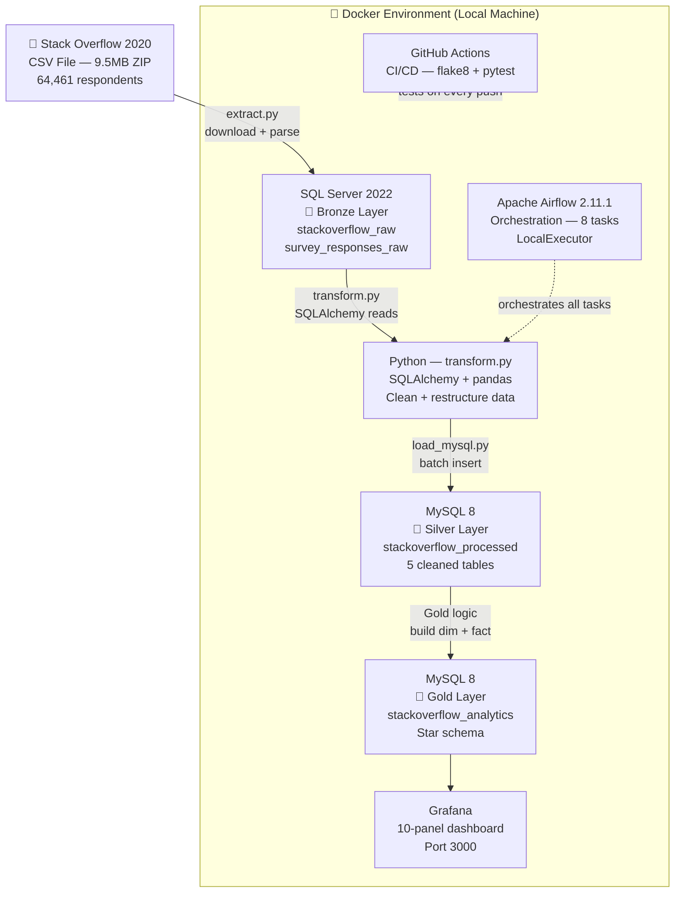

### 2.2 DAG Flow (8 Tasks)

```mermaid
flowchart LR
    T1([start]) --> T2[extract_data]
    T2 --> T3[load_to_sqlserver]
    T3 --> T4[transform_data]
    T4 --> T5[load_to_mysql]
    T5 --> T6[validate_pipeline]
    T6 --> T7[notify_success]
    T7 --> T8([end])

    style T1 fill:#4CAF50,color:#fff
    style T8 fill:#4CAF50,color:#fff
    style T2 fill:#2196F3,color:#fff
    style T3 fill:#FF9800,color:#fff
    style T4 fill:#9C27B0,color:#fff
    style T5 fill:#009688,color:#fff
    style T6 fill:#F44336,color:#fff
    style T7 fill:#607D8B,color:#fff
```

> ⚠️ **Rule:** Each task does ONLY its own stage. Never re-run upstream logic
> in a downstream task — this caused redundant 9.5MB downloads and 10+ min
> durations when broken.

### 2.3 Medallion Architecture — Data Layers

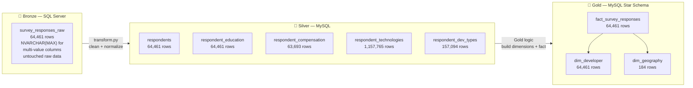

### 2.4 Final Row Counts

| Table | Layer | Rows |
|---|---|---|
| `survey_responses_raw` | Bronze | 64,461 |
| `respondents` | Silver | 64,461 |
| `respondent_education` | Silver | 64,461 |
| `respondent_compensation` | Silver | 63,693 |
| `respondent_technologies` | Silver | 1,157,765 |
| `respondent_dev_types` | Silver | 157,094 |
| `dim_developer` | Gold | 64,461 |
| `dim_geography` | Gold | 184 |
| `fact_survey_responses` | Gold | 64,461 |
| **TOTAL** | | **1,636,580** |

### 2.5 Container Layout

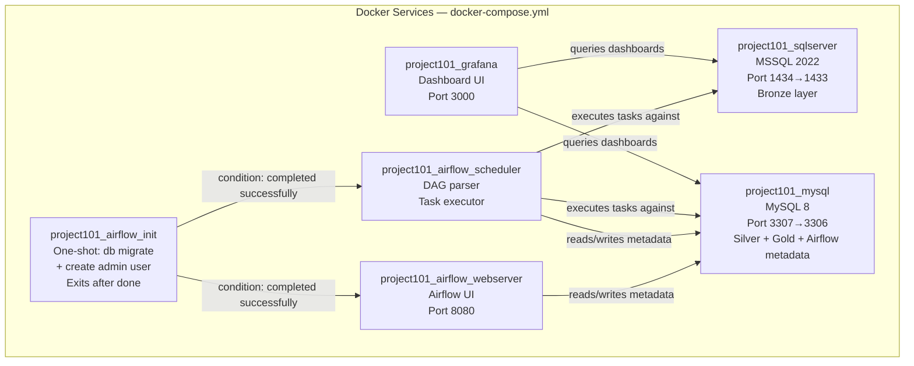

> YAML anchors (`&airflow_env` / `*airflow_env`) share env + volumes across
> the 3 Airflow services to avoid duplication.

### 2.6 Tech Stack — Exact Pins

```
apache-airflow==2.11.1        # NOT 2.8.x, NOT 3.x
pandas>=2.1,<2.2              # NOT 2.2+ — silently fails with SQLAlchemy 1.4
sqlalchemy>=1.4.54,<2.0       # NOT 2.0+ — Airflow 2.11 hard-pins this
numpy>=1.26,<2.3
pymssql==2.3.13
PyMySQL==1.1.2
pyodbc==5.3.0
great-expectations==0.18.22   # NOT 1.x — breaking API rewrite
python-dotenv==1.1.0
openpyxl==3.1.5
pytest==8.3.5
pytest-cov==5.0.0
loguru==0.7.3
tqdm==4.67.3
colorama==0.4.6
```

Base Docker image: `apache/airflow:2.11.1-python3.12`

### 2.7 Top 5 Critical Gotchas

> Full list of 23 issues in `docs/TROUBLESHOOTING.md`

| # | Issue | Fix |
|---|---|---|
| 1 | Pandas 2.2 silently fails with SQLAlchemy 1.4 — empty tables, no error | Pin `pandas<2.2` |
| 2 | MSSQL 18456 "Login Failed" masks "database does not exist" | Grep `/var/opt/mssql/log/errorlog` for real reason |
| 3 | MSSQL volume bakes SA password on first boot only — `.env` changes ignored | `ALTER LOGIN sa` in-place or drop volume |
| 4 | MySQL TRUNCATE blocked by FK constraints on every re-run | `SET FOREIGN_KEY_CHECKS=0` inside `engine.begin()` |
| 5 | Git Bash mangles container paths (`/opt/` → `C:/Program Files/Git/opt/`) | Use leading `//` or `MSYS_NO_PATHCONV=1` |

### 2.8 Grafana Dashboard — 10 Panels

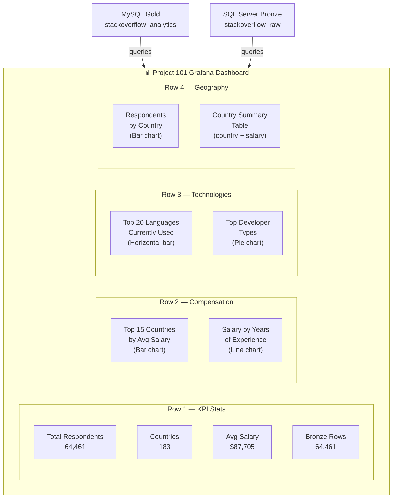

> ⚠️ Dashboards live in `grafana_data` Docker volume only — not exported
> to JSON yet. Will be lost on `docker compose down -v`.

### 2.9 Port Mapping Reference

| Service | Windows Port | Docker Internal |
|---|---|---|
| SQL Server | 1434 | 1433 |
| MySQL | 3307 | 3306 |
| Airflow UI | 8080 | 8080 |
| Grafana | 3000 | 3000 |

### 2.10 Verified Credentials (last green run)

| Service | User | Password |
|---|---|---|
| SQL Server | `sa` | `Pro101Mssql123` |
| MySQL root | `root` | `pro101mysql123` |
| MySQL app | `project101_user` | `pro101mysql123` |
| Airflow | `admin` | `admin123` |
| Grafana | `admin` | `admin123` |

### 2.11 What Is NOT Done in Project 101

- `education_key` and `compensation_key` on `fact_survey_responses` are NULL
- No automated database backups
- Grafana dashboards not exported to JSON in the repo
- DBA ops monitoring dashboard partially started

---

## 3. Project 102 — AWS Cloud-Native Pipeline (IN PROGRESS 🔄)

**GitHub Repo:** `github.com/Thierry0326/Project102_AWS_Pipeline`

### 3.1 Project Statement

> *"Build a flexible serverless AWS pipeline that ingests any World Bank
> development indicator on demand, so analysts can explore relationships
> between economic, health, and education data across 200+ countries
> and 30+ years."*

**This pipeline powers two analytical dashboards:**

| Dashboard | Question |
|---|---|
| **Dashboard 1 — Africa Trends** | How have GDP, life expectancy, and education spending changed across African countries over 30 years — and how does Cameroon compare to regional peers? |
| **Dashboard 2 — Health vs Outcomes** | What is the relationship between health expenditure per capita and health outcomes (mortality, life expectancy) across low and middle income countries? |

### 3.2 Project 101 vs Project 102 — Side by Side

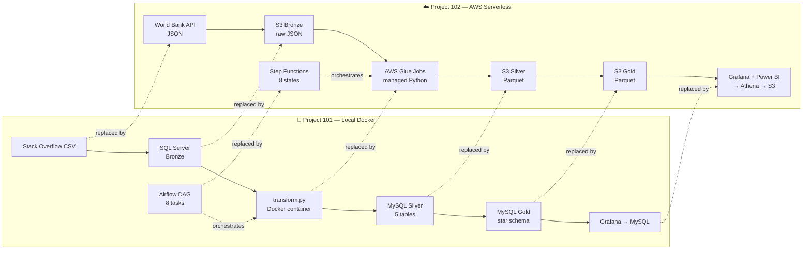

### 3.3 AWS Service Mapping to Project 101

| AWS Service | Project 101 Equivalent | What AWS adds |
|---|---|---|
| S3 | `data/raw/` folder | Distributed, 11-nines durable, lifecycle policies |
| Glue Job | `transform.py` | Managed infra, no Docker, auto-scales |
| Step Functions | Airflow DAG | State machine, built-in retry, serverless |
| EventBridge | Airflow `schedule_interval` | Serverless cron, no scheduler process |
| IAM Roles | `.env` + Linux permissions | Centralized, auditable, rotatable |
| Secrets Manager | `.env` file | Rotation, audit trail, no git exposure |
| VPC | Docker network | Spans data centers, fine-grained routing |
| CloudWatch | `logs/` directory | Queryable, alertable, 7-day retention |
| Athena | MySQL Workbench queries | Serverless SQL, no DB server, pay per query |
| Glue Data Catalog | `mysql_schema.sql` | Auto-inferred, central schema registry |
| SNS | `notify_success` task | Failure + success alerts, push to email |
| Glue Data Quality | `validate_pipeline` task | Declarative rules, integrated with catalog |
| Great Expectations | Same — ported from P101 | Row counts, file integrity, null checks |

### 3.4 The 5 Primitive Cloud Concepts

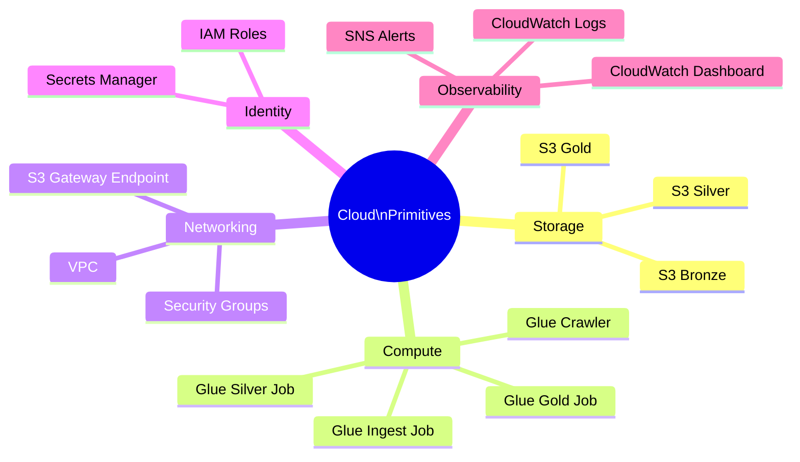

### 3.5 Data Source — World Bank API

| Field | Detail |
|---|---|
| **URL** | `https://api.worldbank.org/v2/country/{country}/indicator/{indicator}?format=json` |
| **Authentication** | None — fully public |
| **Response format** | JSON |
| **Coverage** | 200+ countries, 1960–2024 |
| **Cost** | Free, unlimited |

**Indicators to ingest:**

| Indicator Code | Metric | Dashboard |
|---|---|---|
| `NY.GDP.PCAP.CD` | GDP per capita (USD) | 1 + 2 |
| `SP.DYN.LE00.IN` | Life expectancy at birth | 1 + 2 |
| `SH.XPD.CHEX.PC.CD` | Health expenditure per capita | 2 |
| `SE.XPD.TOTL.GD.ZS` | Education spending (% of GDP) | 1 |
| `SP.POP.TOTL` | Total population | 1 |
| `SH.DYN.MORT` | Child mortality rate | 2 |
| `SI.POV.DDAY` | Poverty headcount ratio | 1 |
| `SP.DYN.IMRT.IN` | Infant mortality rate | 2 |

### 3.6 Medallion Architecture — Data Layers

```mermaid
flowchart LR
    API["🌍 World Bank API\nJSON Response"]

    subgraph BRONZE["🥉 Bronze — S3\np102-bronze/"]
        direction TB
        BJ1["raw_NY.GDP.PCAP.CD.json"]
        BJ2["raw_SP.DYN.LE00.IN.json"]
        BJ3["raw_SH.XPD.CHEX.PC.CD.json"]
        BJ4["... 5 more indicators"]
        BNOTE["Untouched raw JSON\nExactly as API returned\nGlacier after 30 days"]
    end

    subgraph SILVER["🥈 Silver — S3\np102-silver/"]
        direction TB
        SP1["countries.parquet\n200+ rows\ncode, name, region\nincome_group"]
        SP2["indicators.parquet\n8 rows\ncode, name, category"]
        SP3["observations.parquet\n~300,000 rows\ncountry, indicator\nyear, value (cleaned)"]
        SNOTE["Cleaned + normalized\nType-cast values\nNulls handled"]
    end

    subgraph GOLD["🥇 Gold — S3\np102-gold/"]
        direction TB
        G1["dim_country.parquet"]
        G2["dim_indicator.parquet"]
        G3["dim_year.parquet"]
        G4["fact_world_bank.parquet"]
        GNOTE["Dimensional model\nReady for analytics\nAthena queryable"]
    end

    CAT["Glue Data Catalog\nSchema registry\nAll layers registered"]
    ATH["Amazon Athena\nServerless SQL\nPay per query"]

    API -->|"Glue Ingest\n+ GE Validation"| BRONZE
    BRONZE -->|"Glue Transform\n+ Glue DQ"| SILVER
    SILVER -->|"Glue Transform\n+ Glue DQ"| GOLD
    GOLD --> CAT --> ATH
```

### 3.7 Gold Layer — Star Schema Data Model

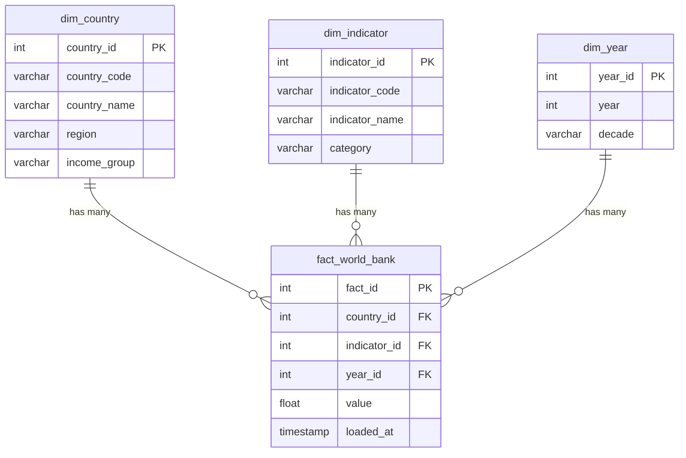

### 3.8 Full Pipeline Architecture

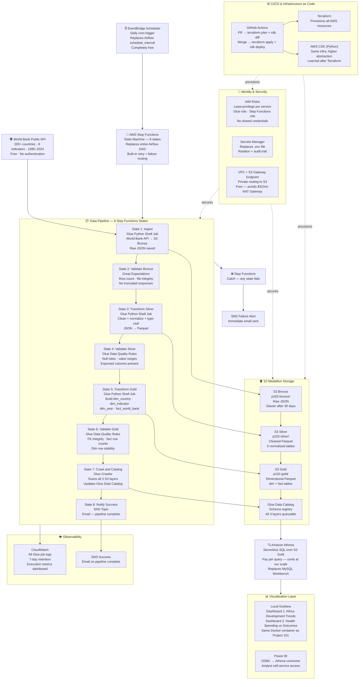

### 3.9 Step Functions State Machine Flow

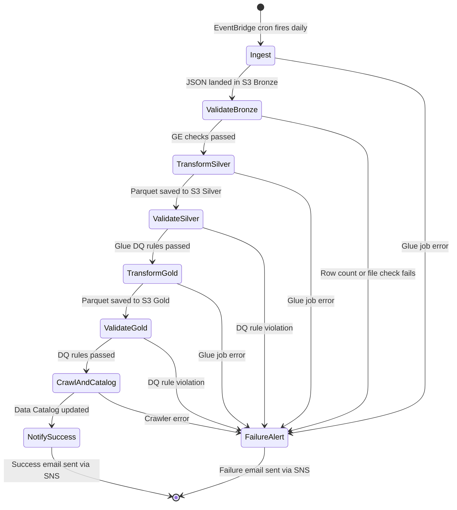

### 3.10 Data Validation Strategy

```mermaid
flowchart LR
    subgraph V1["Bronze Validation\nGreat Expectations"]
        R1["✅ Row count ≥ expected\nper indicator per country"]
        R2["✅ File not empty\nor truncated"]
        R3["✅ Required JSON fields\npresent in response"]
    end

    subgraph V2["Silver Validation\nGlue Data Quality"]
        R4["✅ Null rate < 20%\non value column"]
        R5["✅ Year range\n1990 ≤ year ≤ 2024"]
        R6["✅ Country codes\nmatch ISO standard"]
        R7["✅ All 8 indicators\npresent in output"]
    end

    subgraph V3["Gold Validation\nGlue Data Quality"]
        R8["✅ FK integrity\nall country_id valid"]
        R9["✅ fact_world_bank rows\nmatch Silver observations"]
        R10["✅ dim_country rows\nstable 200+ countries"]
        R11["✅ No duplicate\nfact records"]
    end

    subgraph V4["Pipeline Level\nStep Functions Catch"]
        R12["✅ Any state failure\nroutes to SNS alert"]
        R13["✅ Pipeline halts\non first failure"]
        R14["✅ No silent failures —\nfail loud always"]
    end

    V1 -->|passes| V2 -->|passes| V3 -->|passes| V4
```

### 3.11 Phased Delivery Plan

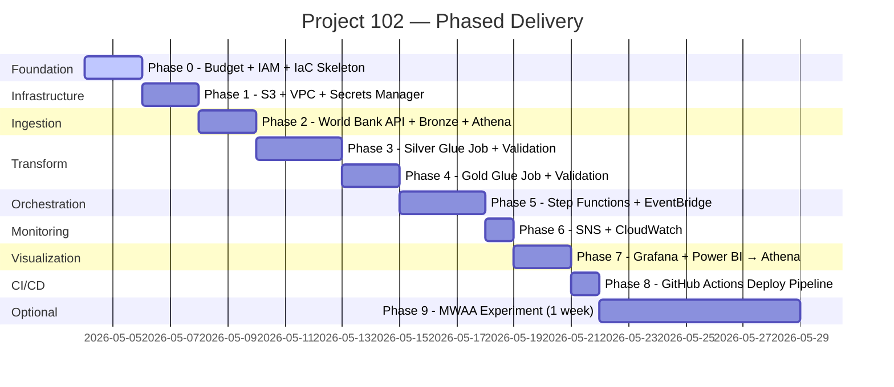

### 3.12 Phase Checklist

| Phase | Focus | Cost | Status |
|---|---|---|---|
| 0 | Budget alarms · IAM · Terraform skeleton · CDK skeleton | Free | 🔄 In progress |
| 1 | S3 buckets · lifecycle rules · VPC · S3 Gateway Endpoint · Secrets Manager | ~$0 | ⬜ |
| 2 | World Bank API → S3 Bronze · Glue Crawler · Athena · GE validation | ~$0 | ⬜ |
| 3 | Glue job: Bronze → Silver Parquet · Glue DQ rules | ~$0.01/run | ⬜ |
| 4 | Glue job: Silver → Gold Parquet · dim/fact build · Glue DQ | ~$0.01/run | ⬜ |
| 5 | Step Functions state machine · EventBridge cron · end-to-end test | Free | ⬜ |
| 6 | SNS alerts · CloudWatch 7-day retention · CloudWatch dashboard | Free | ⬜ |
| 7 | Local Grafana → Athena · Dashboard 1 · Dashboard 2 · Power BI | Free | ⬜ |
| 8 | GitHub Actions: PR → plan/diff · merge → apply/deploy | Free | ⬜ |
| 9 | MWAA 1-week experiment · document vs Step Functions · destroy | ~$20 | ⬜ |

**Phase 0 progress:**
- ✅ AWS account active (paid)
- ✅ Budget alarms set ($1 zero-spend + $10 forecast)
- ✅ GitHub repo created: `Project102_AWS_Pipeline`
- ✅ `.gitignore` configured (Python template)
- ⬜ IAM setup — **next step**
- ⬜ Terraform installed + skeleton
- ⬜ CDK installed + skeleton

### 3.13 Cost Traps — Handle Early

| Trap | Risk | Fix |
|---|---|---|
| NAT Gateway | $32/month minimum | Use S3 Gateway Endpoint (free) |
| CloudWatch log retention | Grows forever by default | Set every log group to 7 days |
| RDS instances | Free tier expires at 12 months | Use S3 + Athena instead |
| Glue Dev Endpoints | ~$0.44/hr when running | Never use — use Glue jobs instead |
| MWAA environment | ~$50-80/mo minimum | Use Step Functions (Phase 9 only if needed) |
| Terraform state in git | Exposes secrets | Use S3 remote backend + DynamoDB lock |

### 3.14 Monthly Cost Estimate

| Service | Estimated Monthly |
|---|---|
| S3 (all 3 buckets + state) | ~$0.01 |
| AWS Glue (2 jobs, daily) | ~$0.50 |
| Amazon Athena (queries) | ~$0.01 |
| Step Functions | Free tier |
| EventBridge Scheduler | Free tier |
| SNS | Free tier |
| CloudWatch | Free tier |
| Secrets Manager | ~$0.80 |
| **Total** | **~$1.50–3/month** |

### 3.15 Repo Structure (Target)

```
Project102_AWS_Pipeline/
├── infrastructure/
│   ├── terraform/
│   │   ├── main.tf
│   │   ├── variables.tf
│   │   ├── outputs.tf
│   │   └── backend.tf          # S3 remote state + DynamoDB lock
│   └── cdk/
│       ├── app.py
│       └── stacks/
├── glue_jobs/
│   ├── ingest.py               # World Bank API → S3 Bronze
│   ├── transform_silver.py     # Bronze → Silver Parquet
│   └── transform_gold.py       # Silver → Gold Parquet (dim + fact)
├── validation/
│   ├── great_expectations/     # Bronze + Silver GE checks
│   └── glue_dq_rules/          # Silver + Gold Glue DQ rules
├── step_functions/
│   └── state_machine.json      # Step Functions definition
├── .github/
│   └── workflows/
│       └── deploy.yml          # CI/CD pipeline
├── docs/
│   ├── PROJECT_CONTEXT.md      # This file
│   └── TROUBLESHOOTING.md      # Issues + fixes log
├── .env.example                # Template only — never real secrets
├── .gitignore                  # Python + Terraform + CDK
└── README.md
```

### 3.16 Learning Philosophy

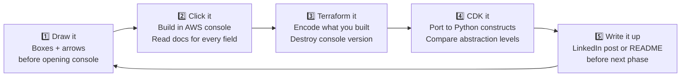

> **Before every resource:** *"I'm using X because without it, Y would happen."*
> If you can't finish that sentence — you don't need X.

---

## 4. Project 103 — Lift and Shift (PLANNED ⬜)

After Project 102 is complete, migrate Project 101 to AWS using
traditional always-on servers to understand the cost and ops difference.

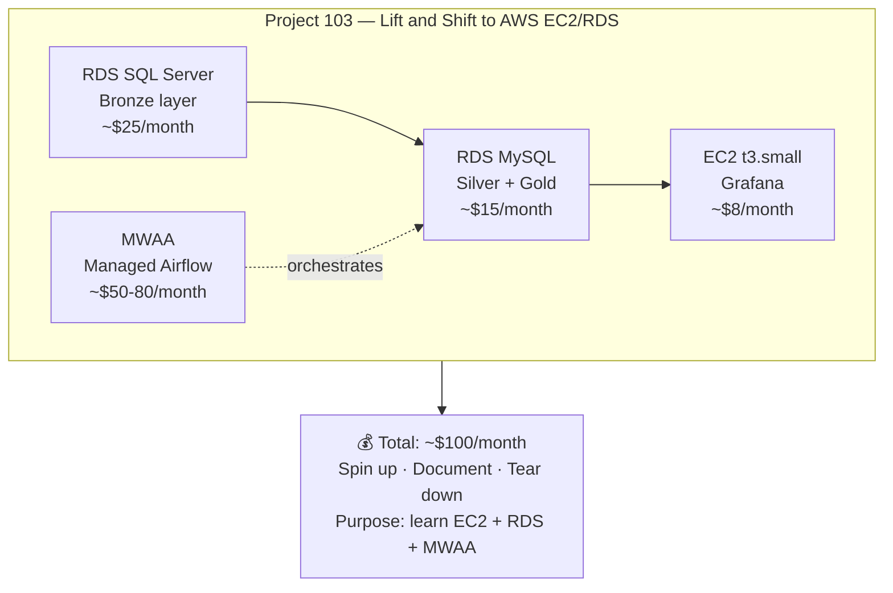

**Purpose:** Produce a 3-way comparison for LinkedIn:

> *"I built the same pipeline three ways —
> local Docker, serverless AWS, and EC2/RDS AWS.
> Here's what I learned about cost, ops, and tradeoffs."*

---

## 5. How to Use This Document

### Starting a New AI Session

Paste this file at the top with:
> *"Here's the full project context. Read this first, then I'll tell you
> what I want to work on next."*

### When Continuing Project 102

Always state:
- Which phase you are on
- What was the last thing completed
- Whether Terraform/CDK has been initialized
- Whether the $1 zero-spend budget has triggered (means something is running)

### What Git Stores vs What Lives in AWS

```mermaid
flowchart LR
    subgraph GIT["✅ Goes to GitHub (instructions)"]
        G1["Terraform .tf files"]
        G2["CDK Python files"]
        G3["Glue job scripts .py"]
        G4["Step Functions .json"]
        G5["Great Expectations config"]
        G6["GitHub Actions workflows"]
        G7[".env.example template"]
        G8["README + docs"]
    end

    subgraph AWS["✅ Lives in AWS (actual resources)"]
        A1["S3 buckets"]
        A2["Glue jobs"]
        A3["Step Functions"]
        A4["IAM roles"]
        A5["CloudWatch logs"]
    end

    subgraph NEVER["❌ Never in Git (secrets + state)"]
        N1[".env real file"]
        N2["terraform.tfstate"]
        N3[".terraform/ folder"]
        N4["cdk.out/ folder"]
        N5["AWS credentials"]
    end

    GH_ACTIONS["GitHub Actions\nreads Git → runs Terraform\n→ creates AWS resources"]

    GIT -->|"triggers"| GH_ACTIONS
    GH_ACTIONS -->|"provisions"| AWS
```

> **Key mental model:** Git stores the **blueprint**. AWS stores the **building**.

---

_Last updated: 2026-05-04_
_Status: Project 101 complete ✅ · Project 102 Phase 0 in progress 🔄 · Project 103 planned ⬜_
_Dataset P101: Stack Overflow 2020 Developer Survey_
_Dataset P102: World Bank Development Indicators API_
_Maintainer: Thierry · github.com/Thierry0326_
