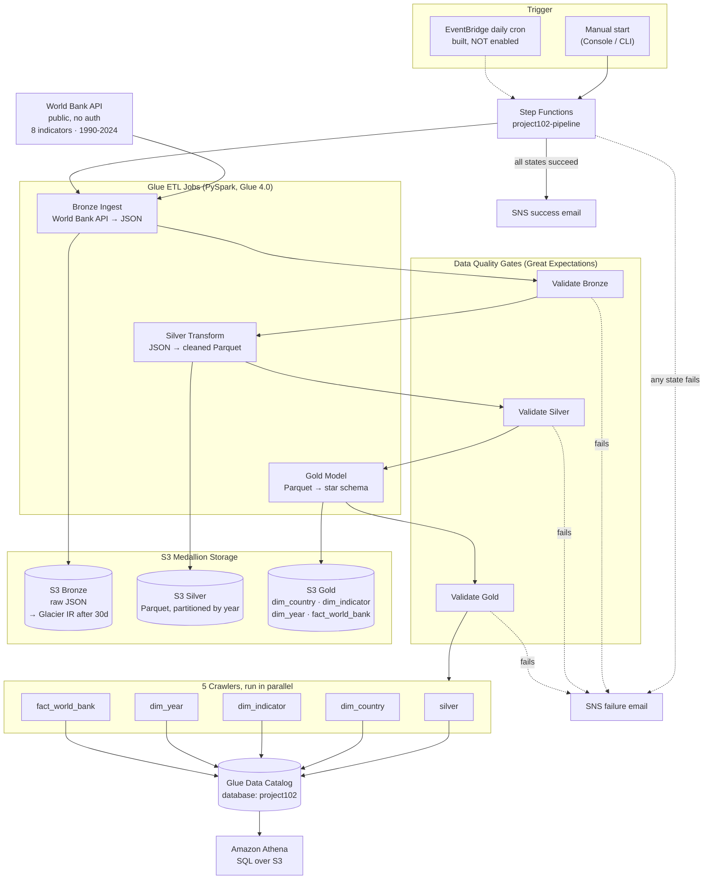
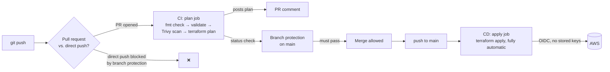

# Project 102 — AWS Serverless Data Pipeline

A cloud-native, serverless ETL pipeline that ingests World Bank development
indicators (GDP, life expectancy, health spending, education spending,
population, mortality) for 200+ countries across 1990–2024, transforms them
through a Bronze → Silver → Gold medallion architecture, and makes the
result queryable in Amazon Athena — no servers, no always-on compute.

This is the cloud successor to **Project 101**, a local Docker/Airflow ETL
pipeline for the Stack Overflow Developer Survey. Same medallion pattern,
same orchestration concept — every local component replaced by its AWS
managed-service equivalent.

> **Status:** Phases 0–3 are built, deployed, and verified end-to-end
> against real AWS resources. Phase 4 (scheduling) is built but
> intentionally left disabled. **CI/CD is fully live** — every push and PR
> runs through GitHub Actions via OIDC (no stored AWS credentials), a Trivy
> security scan, and branch protection on `main`. **Data quality validation**
> now gates every layer with Great Expectations — see
> [Data Quality Validation](#data-quality-validation), [CI/CD](#cicd), and
> [Roadmap](#roadmap).

---

## Architecture



**Supporting infrastructure (not in the data-flow diagram above):**
- **IAM** — one least-privilege role per service (Glue, Step Functions), no shared credentials
- **Secrets Manager** — World Bank API config + pipeline config (bucket names, region), replaces a `.env` file
- **VPC** — private subnets + S3 Gateway Endpoint + a Glue security group exist, but are **intentionally not attached** to the Glue jobs yet (see [Known limitations](#known-limitations))

---

## What's built, phase by phase

| Phase | What it built | Key files |
|---|---|---|
| **0 — Foundation** | S3 remote state backend with native S3 locking, budget alarms, repo/CI scaffolding | `backend.tf`, `main.tf` |
| **1 — Storage & Network** | 3 S3 buckets (Bronze/Silver/Gold) with versioning + lifecycle rules, VPC with private subnets + free S3 Gateway Endpoint, Secrets Manager configs | `s3.tf`, `vpc.tf`, `secrets.tf` |
| **2 — Glue ETL** | 3 PySpark Glue jobs (Bronze ingest, Silver transform, Gold star-schema build), IAM role, Glue Data Catalog + 5 crawlers, S3-backed script deployment | `glue.tf`, `glue_iam.tf`, `glue_crawler.tf`, `glue_jobs/*.py` |
| **3 — Orchestration** | Step Functions state machine chaining all 3 jobs → 5 parallel crawlers → SNS notify, with retry/catch on every state and a bounded poll loop on each crawler | `step_functions.tf`, `state_machine/pipeline.asl.json`, `sns.tf` |
| **4 — Scheduling** | EventBridge daily-cron rule + IAM role to auto-trigger the pipeline — **written, validated, deliberately left commented out** | `eventbridge.tf` |
| **CI/CD — Automated deploys** | GitHub Actions OIDC role (no stored AWS credentials), `plan` job on every PR (fmt check, validate, Trivy security scan, `terraform plan` posted as a PR comment), `apply` job on every push to `main`, branch protection requiring the check to pass before merge | `github_oidc.tf`, `.github/workflows/terraform.yml` |
| **Data Quality Validation** | 3 Great Expectations Glue jobs, one per layer, wired into the state machine as new states right after each ETL job — same Retry/Catch pattern as everything else | `job_validate_bronze.py`, `job_validate_silver.py`, `job_validate_gold.py` |

---

## Data model

**Silver** — one flat table, partitioned by `year`:

```
country_id (str)  country_name  indicator_id (str)  indicator_name
year (int)        value (double)     _ingested_at
```

**Gold** — star schema (3 dimensions + 1 fact), Parquet + Snappy:

```
dim_country          dim_indicator          dim_year            fact_world_bank
  country_id (PK)      indicator_id (PK)      year_id (PK)        fact_id (PK, uuid)
  country_code           indicator_code          year                country_id (FK)
  country_name            indicator_name           decade              indicator_id (FK)
                                                                        year_id (FK)
                                                                        value
                                                                        _ingested_at
```

**Data source:** `https://api.worldbank.org/v2/country/all/indicator/{code}` — public,
no auth. Indicators ingested: `NY.GDP.PCAP.CD`, `SP.DYN.LE00.IN`,
`SH.XPD.CHEX.PC.CD`, `SE.XPD.TOTL.GD.ZS`, `SP.POP.TOTL`, `SH.DYN.MORT`,
`SI.POV.DDAY`, `SP.DYN.IMRT.IN`.

---

## Data Quality Validation

[Great Expectations](https://greatexpectations.io) 0.18.22 — the same
version, and the same reason, Project 101 pinned it (1.x is a breaking API
rewrite) — running inside 3 Glue jobs, one per layer, each gating the
pipeline immediately after that layer's ETL job finishes:

| Layer | Job | Checks |
|---|---|---|
| Bronze | `validate_bronze` | Non-empty, full schema match against the real World Bank response shape, `_ingested_at` not null |
| Silver | `validate_silver` | Non-empty, schema match, `country_id`/`indicator_id` not null, `year` within a loose sanity bound (a corruption check, not the exact 1990–2024 business range) |
| Gold | `validate_gold` | Non-empty + primary-key uniqueness on all 3 dimension tables, and **referential integrity** — `fact_world_bank`'s foreign keys checked against the real dimension key sets (collected to the driver; the dims are small enough that this is cheap) rather than just trusting the join succeeded |

Wired into the state machine as 3 new `Task` states between the existing
ETL jobs (`BronzeIngest → ValidateBronze → SilverTransform → ValidateSilver
→ GoldModel → ValidateGold → CrawlAndCatalog`) — same Retry/Catch pattern as
every other state. A validation failure routes to `NotifyFailure` exactly
like a Glue job crash would.

**The first real run caught a real bug — not in the data, in the
validation script itself.** `job_validate_bronze.py`'s expected schema
had only 5 fields (`country`, `indicator`, `date`, `value`, `_ingested_at`),
built from a comment in `job_silver_transform.py` that lists what *that
job* selects, not the full raw API response. The actual World Bank record
has 8 top-level fields — `countryiso3code`, `decimal`, `obs_status`, and
`unit` were genuinely present and just hadn't been accounted for (plus
`country`/`indicator` show up both as struct columns and as Great
Expectations' flattened dot-paths, `country.id`/`country.value` etc., which
is normal behavior for its Spark engine, not a bug). Fixed using the actual
observed column list — pulled from the failed run's own exception — as
ground truth, rather than guessing again.

---

## Notable bugs fixed along the way

Real problems hit while getting this from "terraform apply succeeds" to
"pipeline actually runs end-to-end" — kept here because the fixes aren't
obvious from the code alone:

| Bug | Root cause | Fix |
|---|---|---|
| `TypeError: allowed_methods` | Glue 4.0's bundled `urllib3` predates the `allowed_methods` kwarg on `Retry()` | Dropped the kwarg — GET is already in urllib3's default retry-safe method set |
| `400 Client Error` from World Bank API | The API intermittently 400s on well-formed requests (confirmed by re-fetching the exact failed URL seconds later and getting `200`) | Added `400` to the `status_forcelist` alongside the usual 5xx codes |
| `InvalidTag` on `terraform apply` | AWS tag values reject `>` and `,` — several `Description` tags used arrows (`->`) and commas | Reworded tag descriptions to avoid both characters |
| `States.MathAdd` — invalid arguments | A Step Functions `Pass` state used `Parameters` (always object-shaped) + `ResultPath: "$.pollCount"`, which nested the counter as `{"pollCount": {"pollCount": N}}` instead of a plain number | Changed `ResultPath` to `"$"` so the Pass state's output replaces the whole scope instead of nesting under an extra key |
| Failed pipeline runs showed `ExecutionSucceeded` | `NotifyFailure` ended with `"End": true` — Step Functions considered the execution to have "succeeded" at notifying about failure | Chained `NotifyFailure` into a new `PipelineFailed` (`Fail`) state so failed runs correctly show red |

Phase 0–1 issues (Terraform install, backend config, tag/lifecycle syntax) are
logged in [`TROUBLESHOOTING.md`](TROUBLESHOOTING.md).

---

## CI/CD



**How it authenticates:** GitHub Actions assumes an IAM role
(`project102-github-actions-role`) via OpenID Connect — GitHub issues a
short-lived signed token per run, AWS verifies it came from this exact repo,
and hands back credentials that expire within the hour. No AWS access keys
are stored anywhere in GitHub. The role's permissions are scoped to
`project102-*` resources, not account-wide admin access.

**CI (`plan` job, every PR):** `terraform fmt -check` → `terraform validate`
→ a [Trivy](https://github.com/aquasecurity/trivy) IaC security scan
(`tfsec` is deprecated and merged into Trivy — same check IDs) → `terraform
plan`, posted as a PR comment. Fails the check — and therefore blocks the
merge — on any CRITICAL/HIGH Trivy finding or a broken plan.

**CD (`apply` job, every push to `main`):** runs `terraform apply` with no
manual approval step. That's intentional, not an oversight — safety comes
from the PR being blocked upstream unless `plan` already passed, so nothing
unreviewed can reach `main` in the first place.

**Branch protection on `main`:** requires a PR (no direct pushes, including
from the repo owner), requires the `plan` check to pass, requires the
branch to be up to date before merging. No required approval count — a
single-maintainer repo would permanently lock itself out otherwise.

**Trivy's first-ever scan of this codebase** surfaced 8 real findings: an
IAM policy `s3:*` wildcard (genuinely fixed — enumerated to specific
actions), a security group with unrestricted egress on all ports (narrowed
to HTTPS/443 only), and 6 "not using a customer-managed KMS key" findings
on SNS topics and S3 buckets (deliberately suppressed via `#trivy:ignore` +
an inline comment — AWS-managed keys are free, a customer-managed key runs
~$1/mo each with no real security benefit for a personal project with no
compliance requirement for custom key rotation).

**Bugs hit building this** (each required reading actual logs, not guessing):

| Bug | Root cause | Fix |
|---|---|---|
| Trivy's SARIF output ignored `#trivy:ignore` suppressions | Confirmed by inspecting the SARIF JSON directly — every suppressed finding showed `suppressed=false`, despite Trivy's own log saying "Ignore finding". Table format honors suppressions correctly; SARIF format doesn't. | Two separate Trivy runs: table format gates the build, SARIF format is upload-only (for the Security tab) and never fails the job |
| `data "aws_kms_alias" "sns"` — "empty result" | `alias/aws/sns` is created lazily by AWS on first use per account/region — a data source can't find an alias that only gets created *by* the resource you're trying to build | Reference the alias by its predictable ARN string instead of looking it up |
| Recurring `AccessDenied` on the CI role, even after "fixing" its policy | Every edit to the GitHub Actions role's own IAM policy only takes effect once someone with broader existing credentials runs `terraform apply` manually — CI can never grant itself new permissions | Hit 3 times; each time, applied the updated policy locally before pushing |
| `terraform plan` succeeded but `terraform apply` failed (`s3:GetBucketAcl`, `s3:GetBucketPolicy`, `states:ValidateStateMachineDefinition`, `ec2:DescribePrefixLists`) | `plan` only diffs; `apply` performs extra "read the resource right back after creating it" API calls that `plan` never exercises. The AWS provider's `aws_s3_bucket` in particular calls a long, undocumented batch of `Get*` APIs on every refresh. | Enumerating individual `Get` actions cost 2 CI round trips before switching to a blanket `s3:Get*` wildcard — safe specifically because every action in that namespace is read-only (confirmed locally that Trivy's wildcard check doesn't flag it, unlike bare `s3:*`) |
| SNS email subscriptions silently vanished from the plan (`2 to add` on an already-deployed pipeline) | Adding KMS encryption *replaced* the SNS topics (new ARNs) rather than updating them in place, orphaning the subscriptions tied to the old ARNs | Recreated them — required re-confirming both subscription emails, since old confirmations don't carry over to new topic ARNs |

---

## Cost

Nothing runs on a schedule right now (Phase 4 is disabled), so the pipeline
only costs money when manually triggered:

| Item | Cost | When it's incurred |
|---|---|---|
| 3 Glue ETL jobs (Bronze/Silver/Gold), ~1 min each | ~$0.02–0.04 total | Per manual run |
| 3 Glue validation jobs (Great Expectations), ~2–3 min each — GE + Spark startup overhead makes these noticeably heavier than the ETL jobs (~0.10 DPU-hours observed for Bronze validation alone) | ~$0.08–0.15 total | Per manual run |
| 5 Glue Crawlers | ~$0.05–0.15 total | Per manual run |
| Step Functions, SNS | Free tier | Per manual run |
| S3 storage (3 buckets, current data volume) | ~$0.01/mo | Ongoing |
| Secrets Manager (2 secrets) | ~$0.80/mo | Ongoing — the dominant idle cost |
| **Idle monthly cost (no schedule)** | **~$0.80/mo** | — |
| **If Phase 4 daily schedule is enabled** | **~$1.60–3.30/mo** | ~$0.20/run × 30 days + idle cost |

Original verified run (3 ETL jobs + 5 crawlers, before validation was added):
**~8m47s**, well under a cent in compute. Adding the 3 validation jobs adds a
few more minutes and a few more cents per run — still comfortably under $0.25
even on a fully loaded execution.

---

## How to run it

**Prerequisites:** an AWS account, [Terraform](https://developer.hashicorp.com/terraform) ≥ 1.5, AWS CLI configured with credentials, an email address for pipeline alerts.

### 1. Deploy the infrastructure

For a first-time bootstrap (or local experimentation):

```bash
cd infrastructure/terraform
terraform init
terraform plan
terraform apply
```

For any change after that, prefer a PR — [CI/CD](#cicd) runs `plan` on the
PR and `apply` automatically once it merges into `main`, which is also now
enforced: `main` is branch-protected, so a manual `apply` against `main`'s
state from your own machine still works, but a direct `git push` to `main`
does not.

### 2. Confirm the SNS subscriptions

AWS emails two confirmation links (success topic + failure topic) to the
address in `var.alert_email` (`variables.tf`). Click **Confirm subscription**
on both — check spam — or you won't receive alerts.

### 3. Run the pipeline

Console: **Step Functions → `project102-pipeline` → Start execution** (leave input as `{}`).

CLI:
```bash
aws stepfunctions start-execution \
  --state-machine-arn $(terraform output -raw state_machine_arn) \
  --name manual-run-1
```

### 4. Query the results in Athena

Set the query result location once (Athena console → Settings) to the value
of `terraform output athena_query_hint`, then:

```sql
SELECT c.country_name, i.indicator_name, y.year, f.value
FROM project102.fact_world_bank f
JOIN project102.dim_country   c ON f.country_id   = c.country_id
JOIN project102.dim_indicator i ON f.indicator_id = i.indicator_id
JOIN project102.dim_year      y ON f.year_id      = y.year_id
WHERE c.country_code = 'CMR'
  AND i.indicator_code = 'SP.DYN.LE00.IN'
ORDER BY y.year;
```

### 5. Tear it down

```bash
terraform destroy
```
S3 buckets don't have `force_destroy` enabled — empty them first (or add
`force_destroy = true` before destroying) if they contain data.

---

## Known limitations

Being upfront about what this pipeline does *not* do yet:

- **VPC isn't wired to the Glue jobs.** Bronze Ingest needs public internet
  access for the World Bank API, which the NAT-less private subnets can't
  provide without adding a ~$32/mo NAT Gateway — a deliberate cost/security
  tradeoff, documented in `vpc.tf`.
- **Full-refresh only.** Every run re-fetches and reprocesses the entire
  1990–2024 history — no incremental/append-only ingestion.
- **Scheduling is built but off** (see `eventbridge.tf`) — the pipeline only
  runs when triggered manually.

---

## Repo structure

```
Project102_AWS_Pipeline/
├── .github/workflows/
│   └── terraform.yml             # CI (plan+Trivy on PR) / CD (apply on merge to main)
├── glue_jobs/
│   ├── job_bronze_ingest.py      # World Bank API → S3 Bronze
│   ├── job_silver_transform.py   # Bronze JSON → Silver Parquet
│   ├── job_gold_model.py         # Silver → Gold star schema
│   ├── job_validate_bronze.py    # Great Expectations gate - Bronze
│   ├── job_validate_silver.py    # Great Expectations gate - Silver
│   └── job_validate_gold.py      # Great Expectations gate - Gold
├── infrastructure/terraform/
│   ├── backend.tf                # S3 remote state
│   ├── main.tf                   # Provider + default tags
│   ├── variables.tf / outputs.tf
│   ├── s3.tf                     # Bronze/Silver/Gold buckets
│   ├── vpc.tf                    # Private subnets, S3 Gateway Endpoint
│   ├── secrets.tf                # Secrets Manager configs
│   ├── glue.tf / glue_iam.tf / glue_crawler.tf
│   ├── s3_glue_scripts_append.tf # Script bucket + upload
│   ├── sns.tf                    # Success/failure topics
│   ├── step_functions.tf         # State machine + IAM
│   ├── github_oidc.tf            # GitHub Actions OIDC trust + IAM role
│   ├── eventbridge.tf            # Daily schedule — reference only
│   └── state_machine/pipeline.asl.json
├── TROUBLESHOOTING.md            # Phase 0-1 issue log
├── PROJECT_CONTEXT.md            # Full planning/context doc
└── README.md
```

---

## Roadmap

- [x] GitHub Actions CI/CD (`plan` on PR, `apply` on merge, Trivy scan, branch protection)
- [x] Data quality validation states (Great Expectations) between layers
- [ ] Enable Phase 4 daily schedule
- [ ] Grafana / Power BI dashboards on top of Athena
- [ ] **Project 103** — lift-and-shift the same pipeline onto EC2/RDS/MWAA for a 3-way cost/ops comparison

---

## Related

- **Project 101** — the local Docker + Airflow ETL pipeline this project is the cloud successor to (Stack Overflow Developer Survey, Medallion architecture, Grafana dashboard).
- **Project 103** *(planned)* — same pipeline, traditional server-based AWS (EC2/RDS/MWAA), for a direct cost and operations comparison against this serverless build.

---

_Maintainer: Thierry — [github.com/Thierry0326](https://github.com/Thierry0326)_
