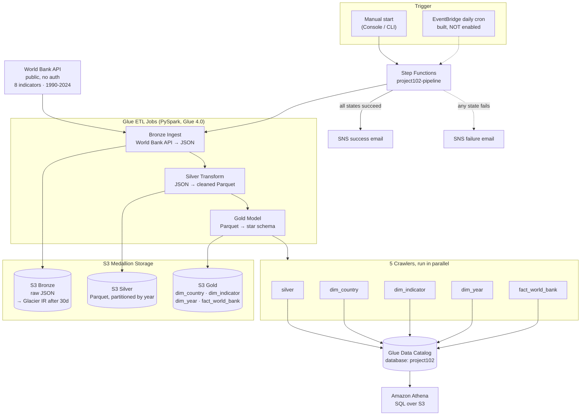

# Project 102 — AWS Serverless Data Pipeline

A cloud-native, serverless ETL pipeline that ingests World Bank development
indicators (GDP, life expectancy, health spending, education spending,
population, mortality) for 200+ countries across 1990–2024, transforms them
through a Bronze → Silver → Gold medallion architecture, and makes the
result queryable in Amazon Athena — no servers, no always-on compute.

This is the cloud successor to **Project 101**, a local Docker/Airflow ETL
pipeline for the Stack Overflow Developer Survey. Same medallion pattern,
same orchestration concept — every local component replaced by its AWS
managed-service equivalent.

> **Status:** Phases 0–3 are built, deployed, and verified end-to-end
> against real AWS resources. Phase 4 (scheduling) is built but
> intentionally left disabled — see [Roadmap](#roadmap).

---

## Architecture



**Supporting infrastructure (not in the data-flow diagram above):**
- **IAM** — one least-privilege role per service (Glue, Step Functions), no shared credentials
- **Secrets Manager** — World Bank API config + pipeline config (bucket names, region), replaces a `.env` file
- **VPC** — private subnets + S3 Gateway Endpoint + a Glue security group exist, but are **intentionally not attached** to the Glue jobs yet (see [Known limitations](#known-limitations))

---

## What's built, phase by phase

| Phase | What it built | Key files |
|---|---|---|
| **0 — Foundation** | S3 remote state backend with native S3 locking, budget alarms, repo/CI scaffolding | `backend.tf`, `main.tf` |
| **1 — Storage & Network** | 3 S3 buckets (Bronze/Silver/Gold) with versioning + lifecycle rules, VPC with private subnets + free S3 Gateway Endpoint, Secrets Manager configs | `s3.tf`, `vpc.tf`, `secrets.tf` |
| **2 — Glue ETL** | 3 PySpark Glue jobs (Bronze ingest, Silver transform, Gold star-schema build), IAM role, Glue Data Catalog + 5 crawlers, S3-backed script deployment | `glue.tf`, `glue_iam.tf`, `glue_crawler.tf`, `glue_jobs/*.py` |
| **3 — Orchestration** | Step Functions state machine chaining all 3 jobs → 5 parallel crawlers → SNS notify, with retry/catch on every state and a bounded poll loop on each crawler | `step_functions.tf`, `state_machine/pipeline.asl.json`, `sns.tf` |
| **4 — Scheduling** | EventBridge daily-cron rule + IAM role to auto-trigger the pipeline — **written, validated, deliberately left commented out** | `eventbridge.tf` |

---

## Data model

**Silver** — one flat table, partitioned by `year`:

```
country_id (str)  country_name  indicator_id (str)  indicator_name
year (int)        value (double)     _ingested_at
```

**Gold** — star schema (3 dimensions + 1 fact), Parquet + Snappy:

```
dim_country          dim_indicator          dim_year            fact_world_bank
  country_id (PK)      indicator_id (PK)      year_id (PK)        fact_id (PK, uuid)
  country_code           indicator_code          year                country_id (FK)
  country_name            indicator_name           decade              indicator_id (FK)
                                                                        year_id (FK)
                                                                        value
                                                                        _ingested_at
```

**Data source:** `https://api.worldbank.org/v2/country/all/indicator/{code}` — public,
no auth. Indicators ingested: `NY.GDP.PCAP.CD`, `SP.DYN.LE00.IN`,
`SH.XPD.CHEX.PC.CD`, `SE.XPD.TOTL.GD.ZS`, `SP.POP.TOTL`, `SH.DYN.MORT`,
`SI.POV.DDAY`, `SP.DYN.IMRT.IN`.

---

## Notable bugs fixed along the way

Real problems hit while getting this from "terraform apply succeeds" to
"pipeline actually runs end-to-end" — kept here because the fixes aren't
obvious from the code alone:

| Bug | Root cause | Fix |
|---|---|---|
| `TypeError: allowed_methods` | Glue 4.0's bundled `urllib3` predates the `allowed_methods` kwarg on `Retry()` | Dropped the kwarg — GET is already in urllib3's default retry-safe method set |
| `400 Client Error` from World Bank API | The API intermittently 400s on well-formed requests (confirmed by re-fetching the exact failed URL seconds later and getting `200`) | Added `400` to the `status_forcelist` alongside the usual 5xx codes |
| `InvalidTag` on `terraform apply` | AWS tag values reject `>` and `,` — several `Description` tags used arrows (`->`) and commas | Reworded tag descriptions to avoid both characters |
| `States.MathAdd` — invalid arguments | A Step Functions `Pass` state used `Parameters` (always object-shaped) + `ResultPath: "$.pollCount"`, which nested the counter as `{"pollCount": {"pollCount": N}}` instead of a plain number | Changed `ResultPath` to `"$"` so the Pass state's output replaces the whole scope instead of nesting under an extra key |
| Failed pipeline runs showed `ExecutionSucceeded` | `NotifyFailure` ended with `"End": true` — Step Functions considered the execution to have "succeeded" at notifying about failure | Chained `NotifyFailure` into a new `PipelineFailed` (`Fail`) state so failed runs correctly show red |

Phase 0–1 issues (Terraform install, backend config, tag/lifecycle syntax) are
logged in [`TROUBLESHOOTING.md`](TROUBLESHOOTING.md).

---

## Cost

Nothing runs on a schedule right now (Phase 4 is disabled), so the pipeline
only costs money when manually triggered:

| Item | Cost | When it's incurred |
|---|---|---|
| 3 Glue jobs (Bronze/Silver/Gold), ~1 min each | ~$0.02–0.04 total | Per manual run |
| 5 Glue Crawlers | ~$0.05–0.15 total | Per manual run |
| Step Functions, SNS | Free tier | Per manual run |
| S3 storage (3 buckets, current data volume) | ~$0.01/mo | Ongoing |
| Secrets Manager (2 secrets) | ~$0.80/mo | Ongoing — the dominant idle cost |
| **Idle monthly cost (no schedule)** | **~$0.80/mo** | — |
| **If Phase 4 daily schedule is enabled** | **~$1.50–3/mo** | ~$0.15/run × 30 days + idle cost |

Full end-to-end verified run: **~8m47s**, 3 Glue jobs + 5 crawlers, well under
a cent in compute per the DPU-hours actually observed.

---

## How to run it

**Prerequisites:** an AWS account, [Terraform](https://developer.hashicorp.com/terraform) ≥ 1.5, AWS CLI configured with credentials, an email address for pipeline alerts.

### 1. Deploy the infrastructure

```bash
cd infrastructure/terraform
terraform init
terraform plan
terraform apply
```

### 2. Confirm the SNS subscriptions

AWS emails two confirmation links (success topic + failure topic) to the
address in `var.alert_email` (`variables.tf`). Click **Confirm subscription**
on both — check spam — or you won't receive alerts.

### 3. Run the pipeline

Console: **Step Functions → `project102-pipeline` → Start execution** (leave input as `{}`).

CLI:
```bash
aws stepfunctions start-execution \
  --state-machine-arn $(terraform output -raw state_machine_arn) \
  --name manual-run-1
```

### 4. Query the results in Athena

Set the query result location once (Athena console → Settings) to the value
of `terraform output athena_query_hint`, then:

```sql
SELECT c.country_name, i.indicator_name, y.year, f.value
FROM project102.fact_world_bank f
JOIN project102.dim_country   c ON f.country_id   = c.country_id
JOIN project102.dim_indicator i ON f.indicator_id = i.indicator_id
JOIN project102.dim_year      y ON f.year_id      = y.year_id
WHERE c.country_code = 'CMR'
  AND i.indicator_code = 'SP.DYN.LE00.IN'
ORDER BY y.year;
```

### 5. Tear it down

```bash
terraform destroy
```
S3 buckets don't have `force_destroy` enabled — empty them first (or add
`force_destroy = true` before destroying) if they contain data.

---

## Known limitations

Being upfront about what this pipeline does *not* do yet:

- **No data quality validation states.** The Step Functions definition goes
  straight Ingest → Transform → Transform → Crawl → Notify. Great
  Expectations / Glue DQ checks between layers are planned, not built.
- **VPC isn't wired to the Glue jobs.** Bronze Ingest needs public internet
  access for the World Bank API, which the NAT-less private subnets can't
  provide without adding a ~$32/mo NAT Gateway — a deliberate cost/security
  tradeoff, documented in `vpc.tf`.
- **No CI/CD.** Deploys are manual `terraform apply`; no GitHub Actions
  plan/apply pipeline yet.
- **Full-refresh only.** Every run re-fetches and reprocesses the entire
  1990–2024 history — no incremental/append-only ingestion.
- **Scheduling is built but off** (see `eventbridge.tf`) — the pipeline only
  runs when triggered manually.

---

## Repo structure

```
Project102_AWS_Pipeline/
├── glue_jobs/
│   ├── job_bronze_ingest.py      # World Bank API → S3 Bronze
│   ├── job_silver_transform.py   # Bronze JSON → Silver Parquet
│   └── job_gold_model.py         # Silver → Gold star schema
├── infrastructure/terraform/
│   ├── backend.tf                # S3 remote state
│   ├── main.tf                   # Provider + default tags
│   ├── variables.tf / outputs.tf
│   ├── s3.tf                     # Bronze/Silver/Gold buckets
│   ├── vpc.tf                    # Private subnets, S3 Gateway Endpoint
│   ├── secrets.tf                # Secrets Manager configs
│   ├── glue.tf / glue_iam.tf / glue_crawler.tf
│   ├── s3_glue_scripts_append.tf # Script bucket + upload
│   ├── sns.tf                    # Success/failure topics
│   ├── step_functions.tf         # State machine + IAM
│   ├── eventbridge.tf            # Daily schedule — reference only
│   └── state_machine/pipeline.asl.json
├── TROUBLESHOOTING.md            # Phase 0-1 issue log
├── PROJECT_CONTEXT.md            # Full planning/context doc
└── README.md
```

---

## Roadmap

- [ ] Data quality validation states (Great Expectations / Glue DQ) between layers
- [ ] Enable Phase 4 daily schedule
- [ ] GitHub Actions CI/CD (`plan` on PR, `apply` on merge)
- [ ] Grafana / Power BI dashboards on top of Athena
- [ ] **Project 103** — lift-and-shift the same pipeline onto EC2/RDS/MWAA for a 3-way cost/ops comparison

---

## Related

- **Project 101** — the local Docker + Airflow ETL pipeline this project is the cloud successor to (Stack Overflow Developer Survey, Medallion architecture, Grafana dashboard).
- **Project 103** *(planned)* — same pipeline, traditional server-based AWS (EC2/RDS/MWAA), for a direct cost and operations comparison against this serverless build.

---

_Maintainer: Thierry — [github.com/Thierry0326](https://github.com/Thierry0326)_
