# Codebase Directory Structure
```text
Project102_AWS_Pipeline/
    .gitattributes
    .gitignore
    project102_mermaid.md
    PROJECT_CONTEXT.md
    PROJECT_CONTEXT_Mermaid.md
    README.md
    TROUBLESHOOTING.md
    glue_jobs/
        job_bronze_ingest.py
        job_gold_model.py
        job_silver_transform.py
    infrastructure/
        cdk/
        terraform/
            backend.tf
            glue.tf
            glue_crawler.tf
            glue_iam.tf
            main.tf
            outputs.tf
            s3.tf
            s3_glue_scripts_append.tf
            secrets.tf
            variables.tf
            vpc.tf
```

# Source Code Details

## File: .gitattributes
```
* text=auto
*.py text eol=lf
*.tf text eol=lf
*.md text eol=lf
*.json text eol=lf
*.yml text eol=lf
*.yaml text eol=lf
```
--------------------------------------------------

## File: .gitignore
```
# Python
__pycache__/
*.py[cod]
*.pyo
*.pyd
.Python
*.pyc

# Environment & Secrets
.env
.env.*
!.env.example

# Terraform
.terraform/
.terraform.lock.hcl
terraform.tfstate
terraform.tfstate.backup
*.tfstate
*.tfstate.*
override.tf
override.tf.json

# CDK
cdk.out/
.cdk.staging/

# AWS
.aws/
credentials

# IDE
.vscode/
.idea/
*.swp

# OS
.DS_Store
Thumbs.db

# Logs
*.log
logs/

```
--------------------------------------------------

## File: project102_mermaid.md
```md
# Project 102 — Architecture Diagrams (Mermaid)

---

## Diagram 1 — Full Pipeline Architecture (Main Diagram)

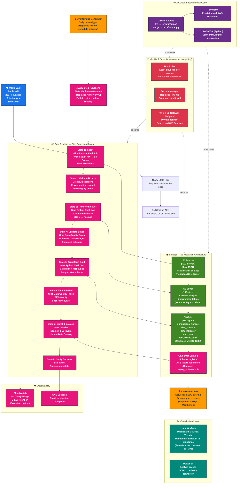

---

## Diagram 2 — Medallion Architecture (Data Layers Only)

```mermaid
flowchart LR
    API["🌍 World Bank API\nJSON Response\n{country, indicator,\nyear, value}"]

    subgraph BRONZE["🥉 Bronze Layer — S3"]
        B1["raw_gdp_per_capita.json"]
        B2["raw_life_expectancy.json"]
        B3["raw_health_expenditure.json"]
        B4["raw_education_spending.json"]
        B5["raw_population.json"]
        B6["... 3 more indicators"]
    end

    subgraph SILVER["🥈 Silver Layer — S3 Parquet"]
        S1["countries.parquet\n200+ rows\ncode, name, region\nincome_group"]
        S2["indicators.parquet\n8 rows\ncode, name, category"]
        S3["observations.parquet\n~300,000 rows\ncountry, indicator\nyear, value (cleaned)"]
    end

    subgraph GOLD["🥇 Gold Layer — S3 Parquet"]
        G1["dim_country.parquet\ncountry_id, code\nname, region\nincome_group"]
        G2["dim_indicator.parquet\nindicator_id, code\nname, category"]
        G3["dim_year.parquet\nyear_id, year\ndecade"]
        G4["fact_world_bank.parquet\nfact_id\ncountry_id FK\nindicator_id FK\nyear_id FK\nvalue, loaded_at"]
    end

    ATH["Amazon Athena\nSQL queries\non Parquet files"]

    API -->|"Glue Ingest Job\nState 1"| BRONZE
    BRONZE -->|"Glue Transform Job\nState 3"| SILVER
    SILVER -->|"Glue Transform Job\nState 5"| GOLD
    GOLD --> ATH

    ATH -->|"Dashboard 1"| D1["Africa Development\nTrends\n(Cameroon focus)"]
    ATH -->|"Dashboard 2"| D2["Health Spending\nvs Outcomes"]
```

---

## Diagram 3 — Step Functions State Machine Flow

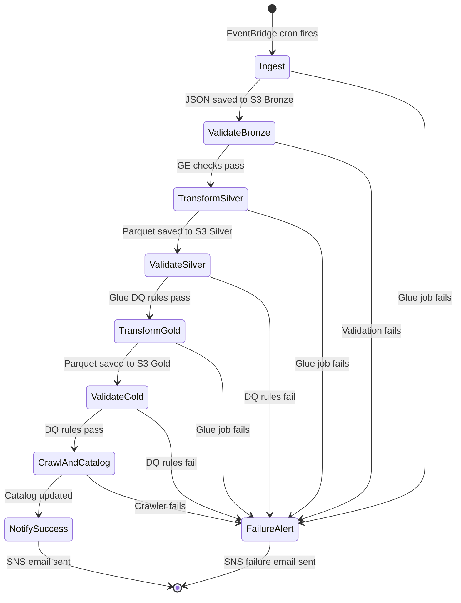

---

## Diagram 4 — Project 101 vs Project 102 Comparison

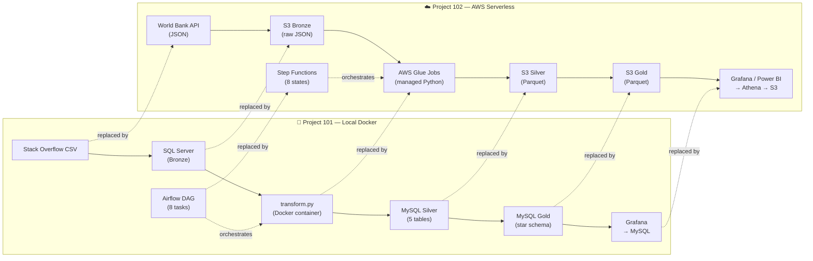

```
--------------------------------------------------

## File: PROJECT_CONTEXT.md
```md
# Project 101 / 102 — Context Primer

A self-contained context document. Paste this at the top of any new AI session
(or share with a collaborator) to bootstrap full understanding of the project
state without needing to re-derive history.

---

## 1. Author Profile

- **Background:** DBA transitioning into cloud data engineering
- **Location:** Bamenda, Cameroon — works at CHPR (health research context)
- **Platform:** Windows 11, Docker Desktop, Git Bash (MINGW64) + PowerShell, VS Code
- **AWS account:** active paid account (no Azure)
- **Constraint:** building on free / zero-cost tooling where possible
- **Working style:** console-first to build mental model, then IaC; prefers
  hands-on typing for muscle memory; values explanation + examples over
  shortcuts; documents failures as well as successes

---

## 2. Project 101 — Local ETL Pipeline (COMPLETE ✅)

End-to-end ETL pipeline for the **Stack Overflow 2020 Developer Survey**,
implementing a full Medallion Architecture (Bronze → Silver → Gold) plus a
live Grafana dashboard. Took **5 DAG runs and 23 documented bugs** to reach green.

### 2.1 Architecture

| Layer | Storage | Notes |
|---|---|---|
| Source | CSV | Stack Overflow 2020 survey, ~9.5MB ZIP, 64,461 respondents |
| Bronze (raw) | SQL Server 2022 | `stackoverflow_raw.dbo.survey_responses_raw` |
| Silver (cleaned) | MySQL 8 | `stackoverflow_processed.*` — 5 tables |
| Gold (analytical) | MySQL 8 | `stackoverflow_analytics.*` — star schema (1 fact + 2 dims) |
| Orchestration | Airflow 2.11.1 | LocalExecutor, metadata in MySQL |
| Monitoring | Grafana | Reads from MySQL + SQL Server datasources |
| CI/CD | GitHub Actions | flake8 + pytest + `docker compose config` |

### 2.2 Final Row Counts (verified loaded end-to-end)

| Table | Rows |
|---|---|
| `stackoverflow_raw.survey_responses_raw` | 64,461 |
| `stackoverflow_processed.respondents` | 64,461 |
| `stackoverflow_processed.respondent_education` | 64,461 |
| `stackoverflow_processed.respondent_compensation` | 63,693 |
| `stackoverflow_processed.respondent_technologies` | 1,157,765 |
| `stackoverflow_processed.respondent_dev_types` | 157,094 |
| `stackoverflow_analytics.dim_developer` | 64,461 |
| `stackoverflow_analytics.dim_geography` | 184 |
| `stackoverflow_analytics.fact_survey_responses` | 64,461 |
| **Total** | **1,636,580** |

### 2.3 Tech Stack — Exact Pins (DO NOT change without reading gotchas)

```
apache-airflow==2.11.1            # NOT 2.8.x (old Python), NOT 3.x (breaks DAG code)
pandas>=2.1,<2.2                  # NOT 2.2+ (silently fails with SQLAlchemy 1.4)
sqlalchemy>=1.4.54,<2.0           # NOT 2.0+ (Airflow 2.11 hard-pins via flask-appbuilder<1.5)
numpy>=1.26,<2.3
pymssql==2.3.13
PyMySQL==1.1.2
pyodbc==5.3.0
great-expectations==0.18.22       # NOT 1.x (breaking API rewrite)
python-dotenv==1.1.0
openpyxl==3.1.5
pytest==8.3.5
pytest-cov==5.0.0
loguru==0.7.3
tqdm==4.67.3
colorama==0.4.6
```

Base Docker image: `apache/airflow:2.11.1-python3.12`

### 2.4 DAG Flow

```
start → extract_data → load_to_sqlserver → transform_data → load_to_mysql
      → validate_pipeline → notify_success → end
```

**Important rule:** each task does ONLY its own stage. Do NOT have downstream
tasks re-run `run_extraction()` or `run_load()`. Each task reads disk/DB
state that the previous task persisted.

### 2.5 Container Layout

| Service | Container name | Role |
|---|---|---|
| `sqlserver` | `project101_sqlserver` | MSSQL 2022 Bronze layer |
| `mysql` | `project101_mysql` | MySQL 8 Silver/Gold + Airflow metadata |
| `grafana` | `project101_grafana` | Dashboard UI at :3000 |
| `airflow-init` | `project101_airflow_init` | One-shot db migrate + admin user |
| `airflow-webserver` | `project101_airflow_webserver` | Airflow UI at :8080 |
| `airflow-scheduler` | `project101_airflow_scheduler` | DAG parser + task executor |

### 2.6 Verified Reference Credentials (as of last green run)

| Service | User | Password |
|---|---|---|
| SQL Server | `sa` | `Pro101Mssql123` |
| MySQL root | `root` | `pro101mysql123` |
| MySQL app user | `project101_user` | `pro101mysql123` |
| Airflow admin | `admin` | `admin123` |
| Grafana admin | `admin` | `admin123` |

### 2.7 Critical Gotchas (top 5 — full list in `docs/TROUBLESHOOTING.md`)

1. **Pandas 2.2 silently breaks with SQLAlchemy 1.4.** Pin `pandas<2.2`.
2. **MSSQL 18456 "Login Failed" often masks "database does not exist."**
   Always grep `/var/opt/mssql/log/errorlog` for the real reason.
3. **MSSQL volume bakes the SA password on FIRST boot only.** Either
   `ALTER LOGIN sa` in-place or drop the volume.
4. **MySQL TRUNCATE blocked by FK constraints** on every re-run. Toggle
   `SET FOREIGN_KEY_CHECKS = 0` inside `engine.begin()`.
5. **Git Bash on Windows mangles container paths.** Fix: leading `//` or
   `MSYS_NO_PATHCONV=1`.

### 2.8 Grafana Dashboard (COMPLETE ✅)

10-panel dashboard — "Project 101 — Stack Overflow Developer Survey 2020":
- Row 1 (KPIs): Total Respondents · Countries · Avg Salary · Bronze Rows
- Row 2 (Compensation): Top 15 Countries by Salary · Salary by Experience
- Row 3 (Technologies): Top 20 Languages · Developer Types pie
- Row 4 (Geography): Respondents by Country · Country summary table

⚠️ Dashboards live in `grafana_data` Docker volume only — not yet exported
to JSON. Will be lost on `docker compose down -v`.

### 2.9 What's NOT Done in Project 101

- `education_key` and `compensation_key` on `fact_survey_responses` are NULL
- No automated backups
- Grafana dashboards not exported to JSON in repo
- DBA ops dashboard partially started

---

## 3. Project 102 — AWS Cloud-Native Pipeline (IN PROGRESS 🔄)

### 3.1 Repository

- **GitHub:** `github.com/Thierry0326/Project102_AWS_Pipeline`
- **Status:** Repo created, .gitignore configured, not yet cloned with code

### 3.2 Project Statement

> "Build a flexible serverless AWS pipeline that ingests any World Bank
> development indicator on demand, so analysts can explore relationships
> between economic, health, and education data across 200+ countries
> and 30+ years."

**This pipeline answers two analytical questions:**

**Dashboard 1 — African Development Trends**
*"How have GDP, life expectancy, and education spending changed across
African countries over the last 30 years, and how does Cameroon compare
to regional peers?"*

**Dashboard 2 — Health Spending vs Outcomes**
*"What is the relationship between health expenditure per capita and key
health outcomes (mortality rates, life expectancy) across low and middle
income countries?"*

### 3.3 Data Source — World Bank API

- **URL:** `https://api.worldbank.org/v2/country/{country}/indicator/{indicator}?format=json`
- **Authentication:** None required (fully public)
- **Format:** JSON
- **Coverage:** 200+ countries, 1960–2024

**Indicators to ingest:**

| Indicator Code | Metric | Dashboard |
|---|---|---|
| `NY.GDP.PCAP.CD` | GDP per capita (USD) | A + B |
| `SP.DYN.LE00.IN` | Life expectancy at birth | A + B |
| `SH.XPD.CHEX.PC.CD` | Health expenditure per capita | B |
| `SE.XPD.TOTL.GD.ZS` | Education spending (% of GDP) | A |
| `SP.POP.TOTL` | Total population | A |
| `SH.DYN.MORT` | Child mortality rate | B |
| `SI.POV.DDAY` | Poverty headcount ratio | A |
| `SP.DYN.IMRT.IN` | Infant mortality rate | B |

### 3.4 Architecture — Project 101 vs Project 102

The same Medallion Architecture, every tool replaced by its AWS equivalent:

| Project 101 (Local Docker) | Project 102 (AWS Serverless) |
|---|---|
| Stack Overflow CSV | World Bank API (JSON) |
| SQL Server (Bronze) | S3 Bronze (raw JSON) |
| `transform.py` in Docker | AWS Glue Python Shell Job |
| MySQL Silver (5 tables) | S3 Silver (cleaned Parquet) |
| MySQL Gold (star schema) | S3 Gold (dimensional Parquet) |
| `mysql_schema.sql` | Glue Data Catalog |
| MySQL Workbench queries | Amazon Athena (SQL on S3) |
| Airflow DAG (8 tasks) | Step Functions (8 states) |
| Airflow cron schedule | EventBridge Scheduler |
| `notify_success` task | SNS email notification |
| `.env` file | AWS Secrets Manager |
| `docker-compose.yml` | Terraform + AWS CDK (Python) |
| GitHub Actions (tests) | GitHub Actions (plan + deploy) |
| Great Expectations | Great Expectations + Glue DQ |
| Grafana → MySQL | Grafana → Athena (local Docker) |

**Key insight:** From a data analyst's perspective Athena IS the database.
They connect Power BI or Grafana to Athena exactly like a SQL database.
The fact that data sits as Parquet files in S3 underneath is invisible to them.

### 3.5 Gold Layer Data Model

```sql
dim_country
    country_id      INT (PK)
    country_code    VARCHAR   -- e.g. "CMR"
    country_name    VARCHAR   -- e.g. "Cameroon"
    region          VARCHAR   -- e.g. "Sub-Saharan Africa"
    income_group    VARCHAR   -- e.g. "Lower middle income"

dim_indicator
    indicator_id    INT (PK)
    indicator_code  VARCHAR   -- e.g. "SP.DYN.LE00.IN"
    indicator_name  VARCHAR   -- e.g. "Life expectancy at birth"
    category        VARCHAR   -- Health / Economy / Education / Demographics

dim_year
    year_id         INT (PK)
    year            INT       -- e.g. 2023
    decade          VARCHAR   -- e.g. "2020s"

fact_world_bank
    fact_id         INT (PK)
    country_id      INT (FK → dim_country)
    indicator_id    INT (FK → dim_indicator)
    year_id         INT (FK → dim_year)
    value           FLOAT
    loaded_at       TIMESTAMP
```

### 3.6 Pipeline Architecture Flow

```
EventBridge Scheduler (daily cron)
        ↓
Step Functions State Machine
        ↓
┌----------------------------------------------────────────────┐
│ State 1: Ingest          World Bank API → S3 Bronze (JSON)   │
│ State 2: Validate Bronze  Great Expectations — row count,    │
│                           file integrity, no empty responses │
│ State 3: Transform Silver Glue Job → S3 Silver (Parquet)     │
│                           clean, normalize, type-cast        │
│ State 4: Validate Silver  Glue Data Quality — null rates,    │
│                           value ranges, expected columns     │
│ State 5: Transform Gold   Glue Job → S3 Gold (Parquet)       │
│                           build dim_country, dim_indicator,  │
│                           dim_year, fact_world_bank          │
│ State 6: Validate Gold    Glue Data Quality — FK integrity,  │
│                           fact row counts, dim stability     │
│ State 7: Crawl & Catalog  Glue Crawler → Glue Data Catalog   │
│                           all 3 layers registered + queryable│
│ State 8: Notify           SNS → success email                │
└----------------------------------------------────────────────┘
        ↓ (on ANY state failure)
SNS Failure Alert → email immediately
        ↓
Local Grafana → Athena → S3 Gold
Power BI → Athena → S3 Gold (analyst access)
```

### 3.7 Learning Philosophy

**Anchor every AWS service to Project 101:**

| AWS Service | Project 101 Equivalent | What AWS adds |
|---|---|---|
| S3 | `data/raw/` folder | Distributed, durable, 11 nines availability |
| Glue | `transform.py` | Managed infra, no Docker, scales automatically |
| Step Functions | Airflow DAG | State machine, built-in retry, zero server |
| IAM | `.env` + Linux file permissions | Centralized, auditable, rotatable |
| VPC | Docker network | Spans data centers, fine-grained routing |
| CloudWatch | `logs/` directory | Queryable, alertable, retained |
| Secrets Manager | `.env` file | Rotation, audit trail, no git exposure |
| Athena | MySQL Workbench | Serverless SQL, no DB server, pay per query |
| Glue Data Catalog | `mysql_schema.sql` | Auto-inferred, central, versioned |
| EventBridge | Airflow schedule_interval | Serverless cron, no scheduler process |
| SNS | `notify_success` task | Push to email/SMS/Lambda, failure routing |

**The 5 primitive concepts — classify every service:**

| Concept | Services in this project |
|---|---|
| Storage | S3 |
| Compute | Glue |
| Networking | VPC, Security Groups, S3 Gateway Endpoint |
| Identity | IAM Roles, Secrets Manager |
| Observability | CloudWatch, SNS |

**Before provisioning any resource, complete this sentence:**
*"I'm using X because without it, Y would happen."*
If you can't finish it, you don't need X.

**IaC learning order per phase:**
1. Draw it (boxes + arrows before opening console)
2. Click it (console, read docs for every field)
3. Terraform it (encode it, destroy console version first)
4. CDK it (port to Python CDK constructs)
5. Write it up (LinkedIn post or README before next phase)

### 3.8 When to Use Serverless vs Other Models

**Serverless wins when:**
- Workload runs on a schedule or triggered by events
- Runtime is minutes not hours
- Load is unpredictable or bursty
- Small team, low ops capacity

**EC2/containers win when:**
- Always-on application (web server, API)
- Runtime exceeds 15 min to hours
- Need SSH access for debugging
- Steady predictable load (reserved instances cheaper)

**Our pipeline is serverless because:** it runs once daily, each job
takes minutes, nothing needs to be always-on. Zero cost when idle.

### 3.9 Phased Plan

| Phase | Focus | Est. cost |
|---|---|---|
| 0 | ✅ Budget alarms set · IAM setup · Terraform skeleton · CDK skeleton | Free |
| 1 | S3 buckets (3-tier) · lifecycle rules · VPC + S3 Gateway Endpoint · Secrets Manager | ~$0 |
| 2 | World Bank API → S3 Bronze · Glue Crawler · Athena query · GE validation | ~$0 |
| 3 | Glue job: Bronze → Silver Parquet · Glue DQ rules | ~$0.01/run |
| 4 | Glue job: Silver → Gold Parquet · dim/fact build · Glue DQ rules | ~$0.01/run |
| 5 | Step Functions state machine + EventBridge daily cron · end-to-end test | Free |
| 6 | SNS failure alerts · CloudWatch 7-day retention · CloudWatch dashboard | Free |
| 7 | Local Grafana → Athena · Dashboard 1 (Africa trends) · Dashboard 2 (Health) | Free |
| 8 | GitHub Actions: PR → plan/diff · merge → apply/deploy | Free |
| 9 | *(optional)* MWAA 1-week experiment · document vs Step Functions · destroy | ~$20 |

**Current status: Phase 0 in progress**
- ✅ AWS account active
- ✅ Budget alarms set ($1 zero-spend + $10 forecast)
- ✅ GitHub repo created: `Project102_AWS_Pipeline`
- ✅ .gitignore configured (Python template)
- ⬜ IAM setup — next step

### 3.10 Cost Traps — Handle on Day One

- ✅ **AWS Budgets alarm** — done
- ⬜ **NAT Gateway = $32/mo minimum** — use S3 Gateway Endpoint (free)
- ⬜ **CloudWatch log retention** — set every log group to 7 days
- ⬜ **S3 lifecycle rules** — Bronze → Glacier after 30 days
- ⬜ **`terraform destroy` habit** — run at end of every work session
- ⬜ **Free tier cliffs** — avoid RDS and EC2 for core pipeline

### 3.11 Monthly Cost Estimate

| Service | Monthly cost |
|---|---|
| S3 (all 3 buckets) | ~$0.01 |
| AWS Glue (2 jobs, daily runs) | ~$0.50 |
| Amazon Athena (queries) | ~$0.01 |
| Step Functions | Free tier |
| EventBridge Scheduler | Free tier |
| SNS | Free tier |
| CloudWatch | Free tier |
| Secrets Manager | ~$0.80 |
| **Total** | **~$1.50–3/month** |

---

## 4. Project 103 — Lift and Shift (PLANNED, NOT STARTED)

After Project 102, migrate Project 101 to AWS using traditional servers:

| Component | AWS Service |
|---|---|
| SQL Server (Bronze) | RDS SQL Server |
| MySQL (Silver/Gold) | RDS MySQL |
| Airflow | MWAA |
| Grafana | EC2 |

**Purpose:** learn EC2, RDS, MWAA; understand cost difference vs serverless;
produce a 3-way comparison (local Docker vs serverless AWS vs EC2/RDS AWS)
for LinkedIn and portfolio.

**Estimated cost:** ~$100/month (spin up, document, tear down quickly)

---

## 5. How to Use This Document

When starting a new AI session, paste this file at the top with:

> "Here's the full context for my project. Read this first, then I'll
> tell you what I want to work on next."

**When continuing Project 102, also state:**
- Which phase you are on
- What was the last thing completed
- Whether Terraform/CDK has been initialized
- Whether the $1 budget alarm has triggered (means something is running)

---

## 6. Repo Structure (Project 102 — target)

```
Project102_AWS_Pipeline/
├── infrastructure/
│   ├── terraform/              # Terraform IaC
│   │   ├── main.tf
│   │   ├── variables.tf
│   │   ├── outputs.tf
│   │   └── backend.tf          # S3 remote state
│   └── cdk/                    # CDK IaC (Python)
│       ├── app.py
│       └── stacks/
├── glue_jobs/
│   ├── ingest.py               # World Bank API → S3 Bronze
│   ├── transform_silver.py     # Bronze → Silver Parquet
│   └── transform_gold.py       # Silver → Gold Parquet (dim/fact)
├── validation/
│   ├── great_expectations/     # Bronze + Silver GE checks
│   └── glue_dq_rules/          # Silver + Gold Glue DQ rules
├── step_functions/
│   └── state_machine.json      # Step Functions definition
├── .github/
│   └── workflows/
│       └── deploy.yml          # CI/CD: plan on PR, apply on merge
├── docs/
│   ├── PROJECT_CONTEXT.md      # This file
│   └── TROUBLESHOOTING.md      # Issues encountered + fixes
├── .env.example                # Template only — never real secrets
├── .gitignore                  # Python + Terraform + CDK
└── README.md
```

---

## 7. Key Files Reference (Project 101 — for porting logic)

| File | What to port into Project 102 |
|---|---|
| `pipeline/extract.py` | Ingest pattern → `glue_jobs/ingest.py` |
| `pipeline/transform.py` | Cleaning logic → `glue_jobs/transform_silver.py` |
| `pipeline/load_mysql.py` | Gold build logic → `glue_jobs/transform_gold.py` |
| `dags/etl_pipeline.py` | DAG structure → `step_functions/state_machine.json` |
| `docs/TROUBLESHOOTING.md` | Reference for debugging patterns |

---

_Last updated: 2026-05-04_
_Status: Project 101 complete ✅ | Project 102 Phase 0 in progress 🔄 | Project 103 planned ⬜_
_Dataset P101: Stack Overflow 2020 Developer Survey_
_Dataset P102: World Bank Development Indicators API_
_Maintainer: Thierry — github.com/Thierry0326_

```
--------------------------------------------------

## File: PROJECT_CONTEXT_Mermaid.md
```md
# Project 101 / 102 — Full Context & Architecture Guide

A self-contained reference document combining project context, architecture
descriptions, data models, and visual diagrams. Paste this at the top of any
new AI session to bootstrap full understanding without re-deriving history.

---

## 📋 Table of Contents

1. [Author Profile](#1-author-profile)
2. [Project 101 — Local ETL Pipeline](#2-project-101--local-etl-pipeline-complete-)
3. [Project 102 — AWS Cloud-Native Pipeline](#3-project-102--aws-cloud-native-pipeline-in-progress-)
4. [Project 103 — Lift and Shift (Planned)](#4-project-103--lift-and-shift-planned)
5. [How to Use This Document](#5-how-to-use-this-document)

---

## 1. Author Profile

| Field | Detail |
|---|---|
| **Background** | DBA transitioning into cloud data engineering |
| **Location** | Bamenda, Cameroon — works at CHPR (health research) |
| **Platform** | Windows 11, Docker Desktop, Git Bash (MINGW64), VS Code |
| **AWS Account** | Active paid account (no Azure) |
| **Constraint** | Free / zero-cost tooling where possible |
| **Working style** | Console-first → IaC; hands-on typing; explains before building; documents failures |

---

## 2. Project 101 — Local ETL Pipeline (COMPLETE ✅)

End-to-end ETL pipeline for the **Stack Overflow 2020 Developer Survey**,
implementing a full Medallion Architecture (Bronze → Silver → Gold) plus a
live Grafana dashboard. Took **5 DAG runs and 23 documented bugs** to reach green.

### 2.1 High-Level Architecture

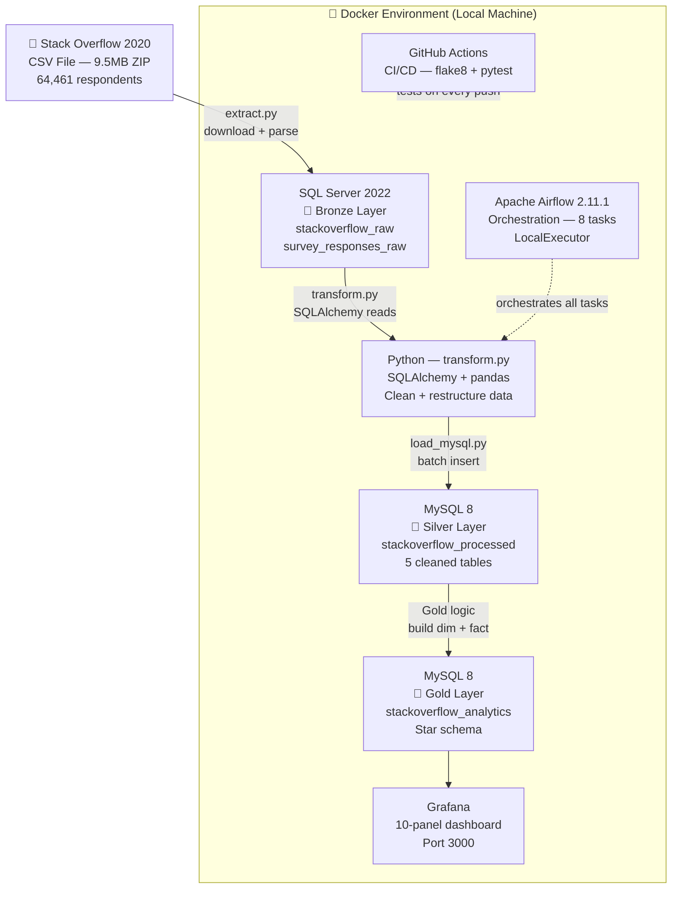

### 2.2 DAG Flow (8 Tasks)

```mermaid
flowchart LR
    T1([start]) --> T2[extract_data]
    T2 --> T3[load_to_sqlserver]
    T3 --> T4[transform_data]
    T4 --> T5[load_to_mysql]
    T5 --> T6[validate_pipeline]
    T6 --> T7[notify_success]
    T7 --> T8([end])

    style T1 fill:#4CAF50,color:#fff
    style T8 fill:#4CAF50,color:#fff
    style T2 fill:#2196F3,color:#fff
    style T3 fill:#FF9800,color:#fff
    style T4 fill:#9C27B0,color:#fff
    style T5 fill:#009688,color:#fff
    style T6 fill:#F44336,color:#fff
    style T7 fill:#607D8B,color:#fff
```

> ⚠️ **Rule:** Each task does ONLY its own stage. Never re-run upstream logic
> in a downstream task — this caused redundant 9.5MB downloads and 10+ min
> durations when broken.

### 2.3 Medallion Architecture — Data Layers

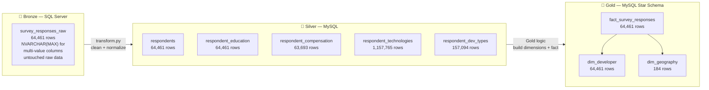

### 2.4 Final Row Counts

| Table | Layer | Rows |
|---|---|---|
| `survey_responses_raw` | Bronze | 64,461 |
| `respondents` | Silver | 64,461 |
| `respondent_education` | Silver | 64,461 |
| `respondent_compensation` | Silver | 63,693 |
| `respondent_technologies` | Silver | 1,157,765 |
| `respondent_dev_types` | Silver | 157,094 |
| `dim_developer` | Gold | 64,461 |
| `dim_geography` | Gold | 184 |
| `fact_survey_responses` | Gold | 64,461 |
| **TOTAL** | | **1,636,580** |

### 2.5 Container Layout

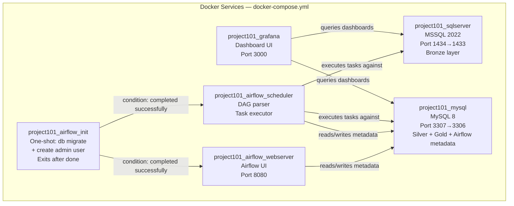

> YAML anchors (`&airflow_env` / `*airflow_env`) share env + volumes across
> the 3 Airflow services to avoid duplication.

### 2.6 Tech Stack — Exact Pins

```
apache-airflow==2.11.1        # NOT 2.8.x, NOT 3.x
pandas>=2.1,<2.2              # NOT 2.2+ — silently fails with SQLAlchemy 1.4
sqlalchemy>=1.4.54,<2.0       # NOT 2.0+ — Airflow 2.11 hard-pins this
numpy>=1.26,<2.3
pymssql==2.3.13
PyMySQL==1.1.2
pyodbc==5.3.0
great-expectations==0.18.22   # NOT 1.x — breaking API rewrite
python-dotenv==1.1.0
openpyxl==3.1.5
pytest==8.3.5
pytest-cov==5.0.0
loguru==0.7.3
tqdm==4.67.3
colorama==0.4.6
```

Base Docker image: `apache/airflow:2.11.1-python3.12`

### 2.7 Top 5 Critical Gotchas

> Full list of 23 issues in `docs/TROUBLESHOOTING.md`

| # | Issue | Fix |
|---|---|---|
| 1 | Pandas 2.2 silently fails with SQLAlchemy 1.4 — empty tables, no error | Pin `pandas<2.2` |
| 2 | MSSQL 18456 "Login Failed" masks "database does not exist" | Grep `/var/opt/mssql/log/errorlog` for real reason |
| 3 | MSSQL volume bakes SA password on first boot only — `.env` changes ignored | `ALTER LOGIN sa` in-place or drop volume |
| 4 | MySQL TRUNCATE blocked by FK constraints on every re-run | `SET FOREIGN_KEY_CHECKS=0` inside `engine.begin()` |
| 5 | Git Bash mangles container paths (`/opt/` → `C:/Program Files/Git/opt/`) | Use leading `//` or `MSYS_NO_PATHCONV=1` |

### 2.8 Grafana Dashboard — 10 Panels

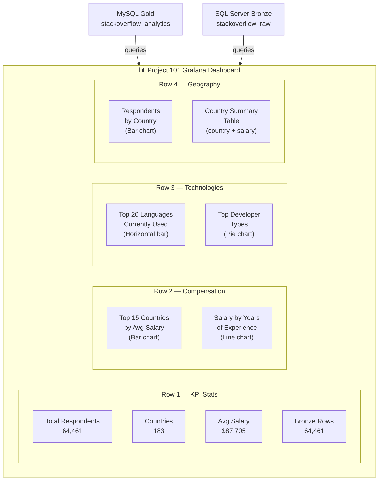

> ⚠️ Dashboards live in `grafana_data` Docker volume only — not exported
> to JSON yet. Will be lost on `docker compose down -v`.

### 2.9 Port Mapping Reference

| Service | Windows Port | Docker Internal |
|---|---|---|
| SQL Server | 1434 | 1433 |
| MySQL | 3307 | 3306 |
| Airflow UI | 8080 | 8080 |
| Grafana | 3000 | 3000 |

### 2.10 Verified Credentials (last green run)

| Service | User | Password |
|---|---|---|
| SQL Server | `sa` | `Pro101Mssql123` |
| MySQL root | `root` | `pro101mysql123` |
| MySQL app | `project101_user` | `pro101mysql123` |
| Airflow | `admin` | `admin123` |
| Grafana | `admin` | `admin123` |

### 2.11 What Is NOT Done in Project 101

- `education_key` and `compensation_key` on `fact_survey_responses` are NULL
- No automated database backups
- Grafana dashboards not exported to JSON in the repo
- DBA ops monitoring dashboard partially started

---

## 3. Project 102 — AWS Cloud-Native Pipeline (IN PROGRESS 🔄)

**GitHub Repo:** `github.com/Thierry0326/Project102_AWS_Pipeline`

### 3.1 Project Statement

> *"Build a flexible serverless AWS pipeline that ingests any World Bank
> development indicator on demand, so analysts can explore relationships
> between economic, health, and education data across 200+ countries
> and 30+ years."*

**This pipeline powers two analytical dashboards:**

| Dashboard | Question |
|---|---|
| **Dashboard 1 — Africa Trends** | How have GDP, life expectancy, and education spending changed across African countries over 30 years — and how does Cameroon compare to regional peers? |
| **Dashboard 2 — Health vs Outcomes** | What is the relationship between health expenditure per capita and health outcomes (mortality, life expectancy) across low and middle income countries? |

### 3.2 Project 101 vs Project 102 — Side by Side

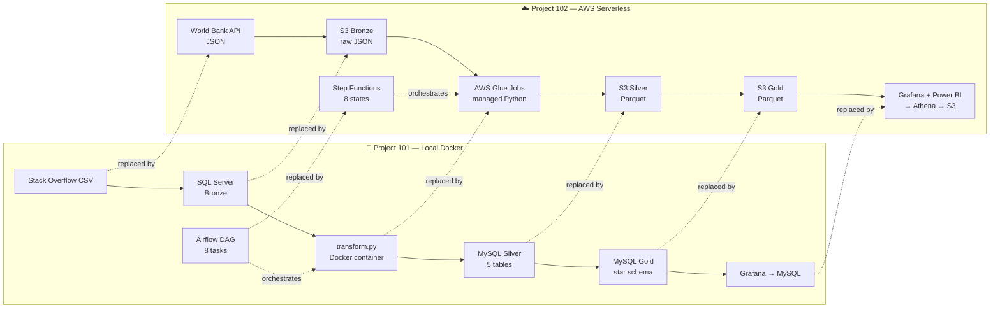

### 3.3 AWS Service Mapping to Project 101

| AWS Service | Project 101 Equivalent | What AWS adds |
|---|---|---|
| S3 | `data/raw/` folder | Distributed, 11-nines durable, lifecycle policies |
| Glue Job | `transform.py` | Managed infra, no Docker, auto-scales |
| Step Functions | Airflow DAG | State machine, built-in retry, serverless |
| EventBridge | Airflow `schedule_interval` | Serverless cron, no scheduler process |
| IAM Roles | `.env` + Linux permissions | Centralized, auditable, rotatable |
| Secrets Manager | `.env` file | Rotation, audit trail, no git exposure |
| VPC | Docker network | Spans data centers, fine-grained routing |
| CloudWatch | `logs/` directory | Queryable, alertable, 7-day retention |
| Athena | MySQL Workbench queries | Serverless SQL, no DB server, pay per query |
| Glue Data Catalog | `mysql_schema.sql` | Auto-inferred, central schema registry |
| SNS | `notify_success` task | Failure + success alerts, push to email |
| Glue Data Quality | `validate_pipeline` task | Declarative rules, integrated with catalog |
| Great Expectations | Same — ported from P101 | Row counts, file integrity, null checks |

### 3.4 The 5 Primitive Cloud Concepts

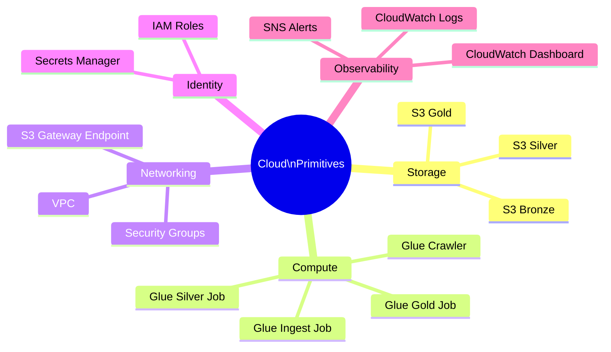

### 3.5 Data Source — World Bank API

| Field | Detail |
|---|---|
| **URL** | `https://api.worldbank.org/v2/country/{country}/indicator/{indicator}?format=json` |
| **Authentication** | None — fully public |
| **Response format** | JSON |
| **Coverage** | 200+ countries, 1960–2024 |
| **Cost** | Free, unlimited |

**Indicators to ingest:**

| Indicator Code | Metric | Dashboard |
|---|---|---|
| `NY.GDP.PCAP.CD` | GDP per capita (USD) | 1 + 2 |
| `SP.DYN.LE00.IN` | Life expectancy at birth | 1 + 2 |
| `SH.XPD.CHEX.PC.CD` | Health expenditure per capita | 2 |
| `SE.XPD.TOTL.GD.ZS` | Education spending (% of GDP) | 1 |
| `SP.POP.TOTL` | Total population | 1 |
| `SH.DYN.MORT` | Child mortality rate | 2 |
| `SI.POV.DDAY` | Poverty headcount ratio | 1 |
| `SP.DYN.IMRT.IN` | Infant mortality rate | 2 |

### 3.6 Medallion Architecture — Data Layers

```mermaid
flowchart LR
    API["🌍 World Bank API\nJSON Response"]

    subgraph BRONZE["🥉 Bronze — S3\np102-bronze/"]
        direction TB
        BJ1["raw_NY.GDP.PCAP.CD.json"]
        BJ2["raw_SP.DYN.LE00.IN.json"]
        BJ3["raw_SH.XPD.CHEX.PC.CD.json"]
        BJ4["... 5 more indicators"]
        BNOTE["Untouched raw JSON\nExactly as API returned\nGlacier after 30 days"]
    end

    subgraph SILVER["🥈 Silver — S3\np102-silver/"]
        direction TB
        SP1["countries.parquet\n200+ rows\ncode, name, region\nincome_group"]
        SP2["indicators.parquet\n8 rows\ncode, name, category"]
        SP3["observations.parquet\n~300,000 rows\ncountry, indicator\nyear, value (cleaned)"]
        SNOTE["Cleaned + normalized\nType-cast values\nNulls handled"]
    end

    subgraph GOLD["🥇 Gold — S3\np102-gold/"]
        direction TB
        G1["dim_country.parquet"]
        G2["dim_indicator.parquet"]
        G3["dim_year.parquet"]
        G4["fact_world_bank.parquet"]
        GNOTE["Dimensional model\nReady for analytics\nAthena queryable"]
    end

    CAT["Glue Data Catalog\nSchema registry\nAll layers registered"]
    ATH["Amazon Athena\nServerless SQL\nPay per query"]

    API -->|"Glue Ingest\n+ GE Validation"| BRONZE
    BRONZE -->|"Glue Transform\n+ Glue DQ"| SILVER
    SILVER -->|"Glue Transform\n+ Glue DQ"| GOLD
    GOLD --> CAT --> ATH
```

### 3.7 Gold Layer — Star Schema Data Model

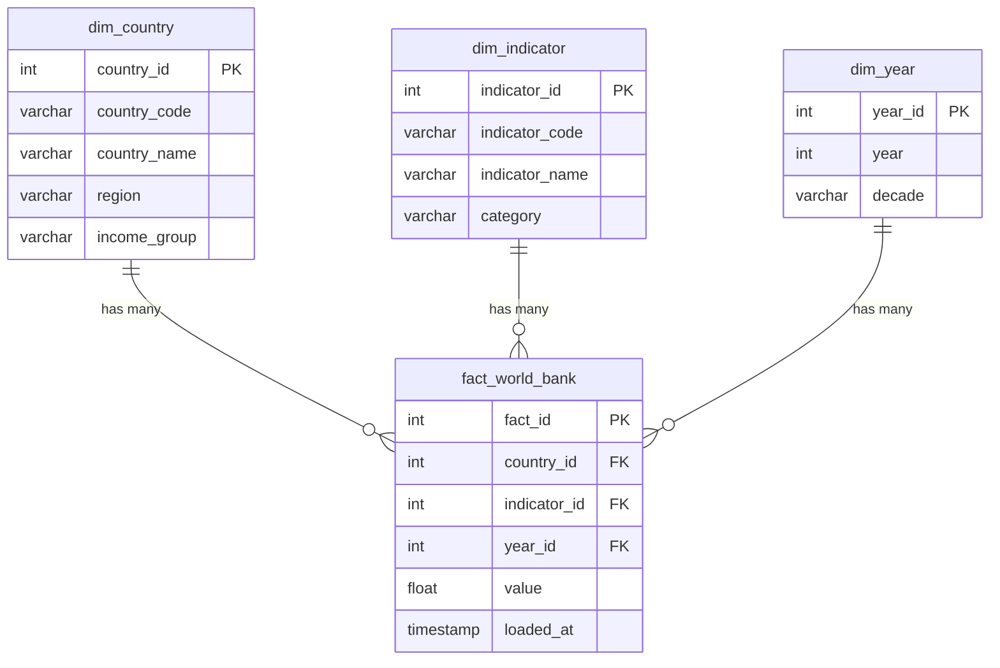

### 3.8 Full Pipeline Architecture

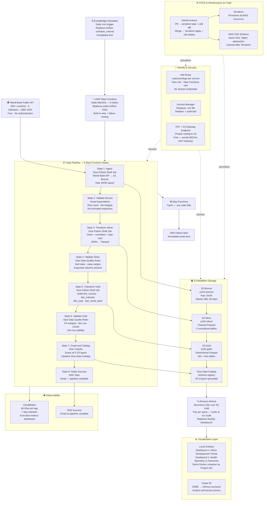

### 3.9 Step Functions State Machine Flow

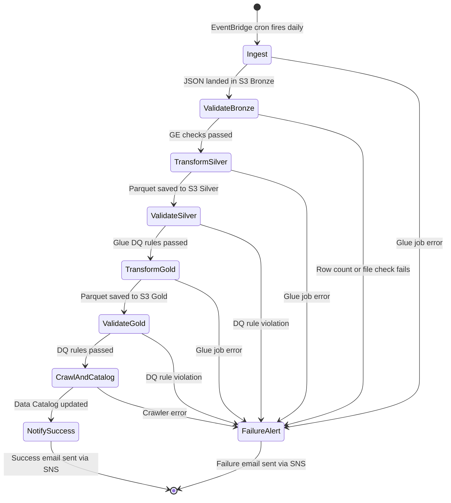

### 3.10 Data Validation Strategy

```mermaid
flowchart LR
    subgraph V1["Bronze Validation\nGreat Expectations"]
        R1["✅ Row count ≥ expected\nper indicator per country"]
        R2["✅ File not empty\nor truncated"]
        R3["✅ Required JSON fields\npresent in response"]
    end

    subgraph V2["Silver Validation\nGlue Data Quality"]
        R4["✅ Null rate < 20%\non value column"]
        R5["✅ Year range\n1990 ≤ year ≤ 2024"]
        R6["✅ Country codes\nmatch ISO standard"]
        R7["✅ All 8 indicators\npresent in output"]
    end

    subgraph V3["Gold Validation\nGlue Data Quality"]
        R8["✅ FK integrity\nall country_id valid"]
        R9["✅ fact_world_bank rows\nmatch Silver observations"]
        R10["✅ dim_country rows\nstable 200+ countries"]
        R11["✅ No duplicate\nfact records"]
    end

    subgraph V4["Pipeline Level\nStep Functions Catch"]
        R12["✅ Any state failure\nroutes to SNS alert"]
        R13["✅ Pipeline halts\non first failure"]
        R14["✅ No silent failures —\nfail loud always"]
    end

    V1 -->|passes| V2 -->|passes| V3 -->|passes| V4
```

### 3.11 Phased Delivery Plan

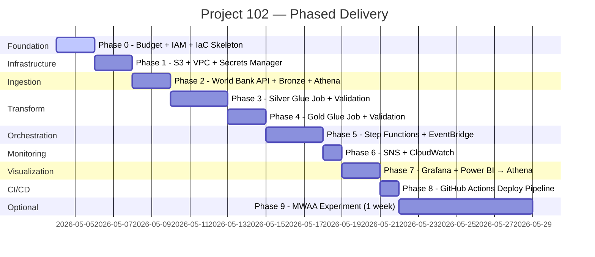

### 3.12 Phase Checklist

| Phase | Focus | Cost | Status |
|---|---|---|---|
| 0 | Budget alarms · IAM · Terraform skeleton · CDK skeleton | Free | 🔄 In progress |
| 1 | S3 buckets · lifecycle rules · VPC · S3 Gateway Endpoint · Secrets Manager | ~$0 | ⬜ |
| 2 | World Bank API → S3 Bronze · Glue Crawler · Athena · GE validation | ~$0 | ⬜ |
| 3 | Glue job: Bronze → Silver Parquet · Glue DQ rules | ~$0.01/run | ⬜ |
| 4 | Glue job: Silver → Gold Parquet · dim/fact build · Glue DQ | ~$0.01/run | ⬜ |
| 5 | Step Functions state machine · EventBridge cron · end-to-end test | Free | ⬜ |
| 6 | SNS alerts · CloudWatch 7-day retention · CloudWatch dashboard | Free | ⬜ |
| 7 | Local Grafana → Athena · Dashboard 1 · Dashboard 2 · Power BI | Free | ⬜ |
| 8 | GitHub Actions: PR → plan/diff · merge → apply/deploy | Free | ⬜ |
| 9 | MWAA 1-week experiment · document vs Step Functions · destroy | ~$20 | ⬜ |

**Phase 0 progress:**
- ✅ AWS account active (paid)
- ✅ Budget alarms set ($1 zero-spend + $10 forecast)
- ✅ GitHub repo created: `Project102_AWS_Pipeline`
- ✅ `.gitignore` configured (Python template)
- ⬜ IAM setup — **next step**
- ⬜ Terraform installed + skeleton
- ⬜ CDK installed + skeleton

### 3.13 Cost Traps — Handle Early

| Trap | Risk | Fix |
|---|---|---|
| NAT Gateway | $32/month minimum | Use S3 Gateway Endpoint (free) |
| CloudWatch log retention | Grows forever by default | Set every log group to 7 days |
| RDS instances | Free tier expires at 12 months | Use S3 + Athena instead |
| Glue Dev Endpoints | ~$0.44/hr when running | Never use — use Glue jobs instead |
| MWAA environment | ~$50-80/mo minimum | Use Step Functions (Phase 9 only if needed) |
| Terraform state in git | Exposes secrets | Use S3 remote backend + DynamoDB lock |

### 3.14 Monthly Cost Estimate

| Service | Estimated Monthly |
|---|---|
| S3 (all 3 buckets + state) | ~$0.01 |
| AWS Glue (2 jobs, daily) | ~$0.50 |
| Amazon Athena (queries) | ~$0.01 |
| Step Functions | Free tier |
| EventBridge Scheduler | Free tier |
| SNS | Free tier |
| CloudWatch | Free tier |
| Secrets Manager | ~$0.80 |
| **Total** | **~$1.50–3/month** |

### 3.15 Repo Structure (Target)

```
Project102_AWS_Pipeline/
├── infrastructure/
│   ├── terraform/
│   │   ├── main.tf
│   │   ├── variables.tf
│   │   ├── outputs.tf
│   │   └── backend.tf          # S3 remote state + DynamoDB lock
│   └── cdk/
│       ├── app.py
│       └── stacks/
├── glue_jobs/
│   ├── ingest.py               # World Bank API → S3 Bronze
│   ├── transform_silver.py     # Bronze → Silver Parquet
│   └── transform_gold.py       # Silver → Gold Parquet (dim + fact)
├── validation/
│   ├── great_expectations/     # Bronze + Silver GE checks
│   └── glue_dq_rules/          # Silver + Gold Glue DQ rules
├── step_functions/
│   └── state_machine.json      # Step Functions definition
├── .github/
│   └── workflows/
│       └── deploy.yml          # CI/CD pipeline
├── docs/
│   ├── PROJECT_CONTEXT.md      # This file
│   └── TROUBLESHOOTING.md      # Issues + fixes log
├── .env.example                # Template only — never real secrets
├── .gitignore                  # Python + Terraform + CDK
└── README.md
```

### 3.16 Learning Philosophy

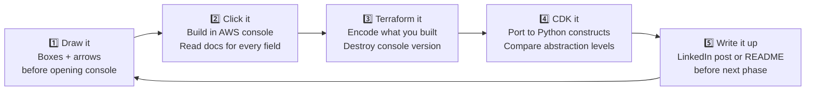

> **Before every resource:** *"I'm using X because without it, Y would happen."*
> If you can't finish that sentence — you don't need X.

---

## 4. Project 103 — Lift and Shift (PLANNED ⬜)

After Project 102 is complete, migrate Project 101 to AWS using
traditional always-on servers to understand the cost and ops difference.

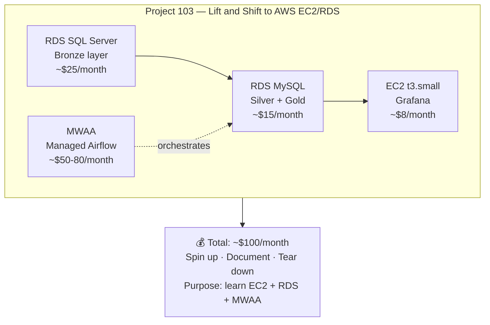

**Purpose:** Produce a 3-way comparison for LinkedIn:

> *"I built the same pipeline three ways —
> local Docker, serverless AWS, and EC2/RDS AWS.
> Here's what I learned about cost, ops, and tradeoffs."*

---

## 5. How to Use This Document

### Starting a New AI Session

Paste this file at the top with:
> *"Here's the full project context. Read this first, then I'll tell you
> what I want to work on next."*

### When Continuing Project 102

Always state:
- Which phase you are on
- What was the last thing completed
- Whether Terraform/CDK has been initialized
- Whether the $1 zero-spend budget has triggered (means something is running)

### What Git Stores vs What Lives in AWS

```mermaid
flowchart LR
    subgraph GIT["✅ Goes to GitHub (instructions)"]
        G1["Terraform .tf files"]
        G2["CDK Python files"]
        G3["Glue job scripts .py"]
        G4["Step Functions .json"]
        G5["Great Expectations config"]
        G6["GitHub Actions workflows"]
        G7[".env.example template"]
        G8["README + docs"]
    end

    subgraph AWS["✅ Lives in AWS (actual resources)"]
        A1["S3 buckets"]
        A2["Glue jobs"]
        A3["Step Functions"]
        A4["IAM roles"]
        A5["CloudWatch logs"]
    end

    subgraph NEVER["❌ Never in Git (secrets + state)"]
        N1[".env real file"]
        N2["terraform.tfstate"]
        N3[".terraform/ folder"]
        N4["cdk.out/ folder"]
        N5["AWS credentials"]
    end

    GH_ACTIONS["GitHub Actions\nreads Git → runs Terraform\n→ creates AWS resources"]

    GIT -->|"triggers"| GH_ACTIONS
    GH_ACTIONS -->|"provisions"| AWS
```

> **Key mental model:** Git stores the **blueprint**. AWS stores the **building**.

---

_Last updated: 2026-05-04_
_Status: Project 101 complete ✅ · Project 102 Phase 0 in progress 🔄 · Project 103 planned ⬜_
_Dataset P101: Stack Overflow 2020 Developer Survey_
_Dataset P102: World Bank Development Indicators API_
_Maintainer: Thierry · github.com/Thierry0326_

```
--------------------------------------------------

## File: README.md
```md
# Project102_AWS_Pipeline
This is an extension of Project101 where everything was done on local machine using docker compose. Project 102 is a cloud-native redesign of the same pipeline, replacing every local component with its AWS serverless equivalent — S3, Glue, Step Functions, and Athena. No servers, no always-on compute.

```
--------------------------------------------------

## File: TROUBLESHOOTING.md
```md
# Project 102 — Troubleshooting Guide

This document records all issues encountered during setup and how they
were resolved. Updated after every phase. Use this as a reference if
you encounter similar problems.

---

## Table of Contents

1. [Terraform App Cannot Run on PC](#1-terraform-app-cannot-run-on-pc)
2. [Terraform Init Network Timeout](#2-terraform-init-network-timeout)
3. [Deprecated dynamodb_table Parameter](#3-deprecated-dynamodb_table-parameter)
4. [variable.tf Named Incorrectly](#4-variabletf-named-incorrectly)
5. [gitattributes Invalid Attribute Warning](#5-gitattributes-invalid-attribute-warning)
6. [LF Will Be Replaced by CRLF Warning](#6-lf-will-be-replaced-by-crlf-warning)
7. [Invalid Resource Type aws_s3_lifecycle_configuration](#7-invalid-resource-type-aws_s3_lifecycle_configuration)
8. [Lifecycle Rule Missing Filter Block](#8-lifecycle-rule-missing-filter-block)
9. [InvalidTag — Em Dash in Tag Values](#9-invalidtag--em-dash-in-tag-values)
10. [InvalidTag — Box Drawing Characters in Comments](#10-invalidtag--box-drawing-characters-in-comments)
11. [Terraform Init Run from Wrong Directory](#11-terraform-init-run-from-wrong-directory)

---

## Phase 0 — Foundation

---

### 1. Terraform App Cannot Run on PC

**Phase:** 0 — Terraform Installation

**Symptom**
```
This app can't run on your PC.
To find a version for your PC, check with the software publisher.
```

**Cause**
Downloaded the wrong architecture version of the Terraform installer
from the website (32-bit or ARM instead of Windows AMD64).

**Fix**
Install via PowerShell instead of manual download:

```powershell
# Option A - winget (simplest)
winget install HashiCorp.Terraform

# Option B - manual PowerShell download (correct architecture)
Invoke-WebRequest -Uri "https://releases.hashicorp.com/terraform/1.8.5/terraform_1.8.5_windows_amd64.zip" -OutFile "terraform.zip"
Expand-Archive -Path "terraform.zip" -DestinationPath "C:\terraform"
[Environment]::SetEnvironmentVariable("PATH", $env:PATH + ";C:\terraform", [EnvironmentVariableTarget]::Machine)
```

Open a new terminal after installation and verify:
```powershell
terraform --version
```

**Prevention**
Always use `winget` on Windows for CLI tool installation — it
automatically selects the correct architecture.

---

### 2. Terraform Init Network Timeout

**Phase:** 0 — Terraform Initialization

**Symptom**
```
Error: Failed to install provider
Error while installing hashicorp/aws v5.100.0:
releases.hashicorp.com: read tcp ...: wsarecv: A connection attempt
failed because the connected party did not properly respond after a
period of time
```

**Cause**
Unstable internet connection dropped during the ~80MB AWS provider
download from `releases.hashicorp.com`.

**Fix**
Simply retry — Terraform retries the download cleanly:

```powershell
terraform init
```

If it keeps timing out, force a clean retry:

```powershell
Remove-Item -Recurse -Force .terraform
terraform init
```

**Prevention**
Run `terraform init` on a stable connection. The download only
happens once — subsequent inits reuse the cached provider from
`.terraform/providers/`.

---

### 3. Deprecated dynamodb_table Parameter

**Phase:** 0 — Remote State Backend

**Symptom**
```
Warning: Deprecated Parameter
  on backend.tf line 6, in terraform:
   6:     dynamodb_table = "project102-terraform-dynamodb-locks"
The parameter "dynamodb_table" is deprecated.
Use parameter "use_lockfile" instead.
```

**Cause**
Terraform AWS provider v5.x introduced a native S3 lock file mechanism.
The old approach required a separate DynamoDB table for state locking.
The new approach stores the lock directly in S3 as a `.tflock` file —
simpler and cheaper (no DynamoDB table needed).

**Fix**
Update `backend.tf` — replace `dynamodb_table` with `use_lockfile`:

```hcl
# Before (deprecated):
terraform {
  backend "s3" {
    bucket         = "project102-terraform-state-XXXX"
    key            = "project102/terraform.tfstate"
    region         = "us-east-1"
    dynamodb_table = "project102-terraform-locks"
    encrypt        = true
  }
}

# After (current):
terraform {
  backend "s3" {
    bucket       = "project102-terraform-state-XXXX"
    key          = "project102/terraform.tfstate"
    region       = "us-east-1"
    use_lockfile = true
    encrypt      = true
  }
}
```

Then reinitialize:
```powershell
terraform init -reconfigure
```

Delete the now-unused DynamoDB table in the AWS Console:
AWS Console → DynamoDB → Tables → select table → Delete

**Prevention**
Check Terraform provider changelog when upgrading versions.
Run `terraform init -upgrade` periodically to catch deprecation
warnings early.

---

### 4. variable.tf Named Incorrectly

**Phase:** 0 — Terraform Skeleton

**Symptom**
File committed to Git as `variable.tf` instead of `variables.tf`.
Inconsistent with Terraform community conventions.

**Cause**
Typo during initial file creation.

**Fix**
Rename using git mv to preserve history:

```powershell
git mv variable.tf variables.tf
git add .
git commit -m "Fix: rename variable.tf to variables.tf"
git push origin main
```

**Prevention**
Standard Terraform file naming convention:
- `main.tf` — provider + terraform block
- `variables.tf` — input variables (plural)
- `outputs.tf` — output values (plural)
- `backend.tf` — remote state configuration
- `s3.tf`, `iam.tf`, `vpc.tf` — resources grouped by service

---

### 5. gitattributes Invalid Attribute Warning

**Phase:** 0 — Git Configuration

**Symptom**
```
.gitattributes" is not a valid attribute name: .gitattributes:16
```

**Cause**
PowerShell's `Out-File` with heredoc syntax added a trailing quote
character or invisible character at line 16 of the `.gitattributes`
file, creating an invalid attribute name.

**Fix**
Open `.gitattributes` in VS Code, delete all content, and retype
manually (do not copy-paste from chat):

```
* text=auto
*.py text eol=lf
*.tf text eol=lf
*.md text eol=lf
*.json text eol=lf
*.yml text eol=lf
*.yaml text eol=lf
```

Save → commit → push.

**Prevention**
Always verify file contents with `cat .gitattributes` after
creating config files via PowerShell heredoc. Special characters
can be silently injected by the shell.

---

### 6. LF Will Be Replaced by CRLF Warning

**Phase:** 0 — Git Push

**Symptom**
```
warning: in the working copy of 'PROJECT_CONTEXT_Mermaid.md',
LF will be replaced by CRLF the next time Git touches it
```

**Cause**
Windows uses CRLF (`\r\n`) line endings. Linux/Mac use LF (`\n`).
Files created on Windows get CRLF; files created on Linux/Mac get LF.
When Git on Windows checks in a LF file, it warns that it will
convert it.

**Fix**
Add a `.gitattributes` file to normalize line endings:

```
* text=auto
*.py text eol=lf
*.tf text eol=lf
*.md text eol=lf
*.json text eol=lf
```

`text=auto` tells Git to handle conversion automatically.
`eol=lf` forces specific file types to always use LF in the repo.

**Prevention**
Add `.gitattributes` at the very start of every project before
the first commit. This is a one-time setup that prevents all
future LF/CRLF noise.

---

## Phase 1 — Storage Layer

---

### 7. Invalid Resource Type aws_s3_lifecycle_configuration

**Phase:** 1 — S3 Buckets

**Symptom**
```
Error: Invalid resource type
  on s3.tf line 42, in resource "aws_s3_lifecycle_configuration" "bronze":
  42: resource "aws_s3_lifecycle_configuration" "bronze" {
The provider hashicorp/aws does not support resource type
"aws_s3_lifecycle_configuration".
```

**Cause**
Wrong resource type name used. The AWS Terraform provider uses
`aws_s3_bucket_lifecycle_configuration` — it requires `bucket_`
in the middle of the name.

**Fix**
In `s3.tf` rename the resource:

```hcl
# Before (wrong):
resource "aws_s3_lifecycle_configuration" "bronze" {

# After (correct):
resource "aws_s3_bucket_lifecycle_configuration" "bronze" {
```

**General rule**
Most S3-related Terraform resources follow the pattern:
`aws_s3_bucket_<feature>` — for example:
- `aws_s3_bucket_versioning`
- `aws_s3_bucket_public_access_block`
- `aws_s3_bucket_lifecycle_configuration`
- `aws_s3_bucket_policy`

When in doubt run `terraform providers schema` or check the
Terraform AWS provider docs at
`registry.terraform.io/providers/hashicorp/aws/latest/docs`.

---

### 8. Lifecycle Rule Missing Filter Block

**Phase:** 1 — S3 Lifecycle Configuration

**Symptom**
```
Warning: Invalid Attribute Combination
  with aws_s3_bucket_lifecycle_configuration.bronze,
  on s3.tf line 45, in resource "aws_s3_bucket_lifecycle_configuration" "bronze":
  45:   rule {
No attribute specified when one (and only one) of
[rule[0].filter, rule[0].prefix] is required
This will be an error in a future version of the provider
```

**Cause**
AWS S3 lifecycle rules require a `filter` block to specify which
objects the rule applies to. Without it, the provider does not know
the scope of the rule. In older provider versions this defaulted to
all objects — in v5.x it is required explicitly.

**Fix**
Add an empty `filter` block with `prefix = ""` to match all objects:

```hcl
resource "aws_s3_bucket_lifecycle_configuration" "bronze" {
  bucket = aws_s3_bucket.bronze.id

  rule {
    id     = "move-to-glacier"
    status = "Enabled"

    filter {
      prefix = ""    # empty string = apply to ALL objects in bucket
    }

    transition {
      days          = 30
      storage_class = "GLACIER_IR"
    }
  }
}
```

**Prevention**
Always include a `filter` block in lifecycle rules even when
targeting all objects. Explicit is better than implicit —
this matches the direction the provider is moving.

---

### 9. InvalidTag — Em Dash in Tag Values

**Phase:** 1 — S3 Bucket Tags

**Symptom**
```
Error: setting S3 Bucket (project102-bronze-raw) tags:
api error InvalidTag: The TagValue you have provided is invalid
```

**Cause**
AWS S3 tag values only accept basic ASCII characters. The em dash
character `—` (Unicode U+2014) copied from a chat interface was
used in the Description tag value:

```hcl
# This fails — em dash is not ASCII:
Description = "Raw JSON from World Bank API — untouched"
```

**Fix**
Replace em dash `—` with a plain ASCII hyphen `-`:

```hcl
# This works:
Description = "Raw JSON from World Bank API - untouched"
```

**General rule**
AWS tag values must be plain ASCII. Characters that commonly
cause this issue:
- Em dash `—` (U+2014) — use `-` instead
- En dash `–` (U+2013) — use `-` instead
- Smart quotes `"` `"` — use `"` instead
- Ellipsis `…` (U+2026) — use `...` instead
- Any Unicode character above U+007F

**Prevention**
Never copy-paste tag values directly from chat interfaces, Word
documents, or websites. Type tag values manually in VS Code to
ensure plain ASCII characters only.

---

### 10. InvalidTag — Box Drawing Characters in Comments

**Phase:** 1 — S3 Bucket Tags

**Symptom**
```
Error: setting S3 Bucket (project102-gold-analytics) tags:
api error InvalidTag: The TagValue you have provided is invalid
```

Gold bucket kept failing even after fixing the em dash. The
Description tag looked clean in the terminal but the error persisted.

**Cause**
The HCL comment separator lines used box-drawing characters
(Unicode U+2500 `─`) which appeared as `â"€` when the file
encoding was misread:

```hcl
# ──────────────────────────────────────────────
# GOLD BUCKET - Dimensional Parquet (Analytics)
# ──────────────────────────────────────────────
```

AWS rejected the entire bucket resource block because these
non-ASCII characters existed anywhere in the associated `.tf` file.

**Diagnosis**
Run this to find all non-ASCII characters in a file:

```powershell
$content = Get-Content s3.tf -Raw
$content | ForEach-Object {
    $chars = $_.ToCharArray()
    $chars | ForEach-Object {
        if ([int]$_ -gt 127) {
            Write-Host "Non-ASCII: '$_' (code: $([int]$_))"
        }
    }
}
```

**Fix**
In VS Code use Find and Replace (`Ctrl+H`):
- Find: `──────────────────────────────────────────────`
- Replace: `----------------------------------------------`
- Click Replace All

Replace ALL decorative separator lines throughout the file.

**Prevention**
Use only plain ASCII characters in `.tf` files:
- Comments: use `#` with plain `-` for separators
- No box-drawing characters, no Unicode decorations
- Set VS Code to show non-printable characters:
  View → Render Whitespace → helps spot invisible characters

---

### 11. Terraform Init Run from Wrong Directory

**Phase:** 0 — Terraform Initialization

**Symptom**
```
Terraform initialized in an empty directory!
The directory has no Terraform configuration files.
```

**Cause**
`terraform init` was run from the repo root
(`Project102_AWS_Pipeline/`) instead of the terraform directory
(`Project102_AWS_Pipeline/infrastructure/terraform/`).

**Fix**
Always navigate to the terraform directory before running any
Terraform commands:

```powershell
cd infrastructure/terraform
terraform init
terraform plan
terraform apply
```

**Prevention**
Check your prompt before running Terraform commands. The path
should always end with `infrastructure/terraform`. Add this
check as a habit:

```powershell
# Verify you are in the right place
pwd
# Should show: ...Project102_AWS_Pipeline\infrastructure\terraform
```

---

## Prevention Tips Summary

1. **ASCII only in .tf files** — no em dashes, box-drawing characters,
   smart quotes, or any Unicode above U+007F in resource configurations
   or tag values.

2. **Always run terraform plan before apply** — read every `+`, `~`,
   `-` symbol before typing yes. If something unexpected shows up, stop
   and investigate.

3. **Check your directory before Terraform commands** — `pwd` should
   always show `infrastructure/terraform`.

4. **Add .gitattributes at project start** — prevents LF/CRLF noise
   on every subsequent push.

5. **Terraform resource names follow patterns** — S3 resources are
   `aws_s3_bucket_<feature>`. When unsure check
   `registry.terraform.io/providers/hashicorp/aws/latest/docs`.

6. **State management picks up where it left off** — if `apply` fails
   halfway, fix the error and run `apply` again. Terraform skips
   resources already created. Never manually delete partially-created
   resources unless you also run `terraform state rm`.

7. **Remote state is your safety net** — the S3 backend means your
   state is safe even if your laptop dies. Always confirm
   `Successfully configured the backend "s3"` during init.

8. **Tag values are validated by AWS** — test tag values mentally
   against ASCII-only before applying. Description fields are the
   most common place special characters sneak in.

---

## Quick Reference — Terraform Commands

```powershell
# Initialize (first time or after backend change)
terraform init

# Initialize and migrate state to new backend
terraform init -migrate-state

# Initialize and force reconfigure
terraform init -reconfigure

# Preview changes without touching AWS
terraform plan

# Apply changes (always review plan output first)
terraform apply

# Destroy all resources (careful - irreversible)
terraform destroy

# Show current state
terraform show

# List resources in state
terraform state list

# Refresh outputs
terraform refresh
terraform output

# Validate syntax without connecting to AWS
terraform validate

# Format .tf files to standard style
terraform fmt

# Find non-ASCII characters in a file (PowerShell)
$content = Get-Content filename.tf -Raw
$content.ToCharArray() | Where-Object { [int]$_ -gt 127 } |
    ForEach-Object { Write-Host "Non-ASCII: '$_' (code: $([int]$_))" }
```

---

_Last updated: 2026-05-04_
_Status: Phase 0 complete ✅ | Phase 1 S3 complete ✅ | VPC + Secrets Manager pending_
_Project: Project102_AWS_Pipeline_
_Maintainer: Thierry — github.com/Thierry0326_

```
--------------------------------------------------

## File: glue_jobs\job_bronze_ingest.py
```python
"""
job_bronze_ingest.py
World Bank API → S3 Bronze (raw JSONL)

Project 101 equivalent: pipeline/extract.py
What AWS adds: runs serverless on Glue, secrets from Secrets Manager,
               output lands directly in S3 — no local disk needed
"""
import sys
import json
import time
import boto3
import requests
from requests.adapters import HTTPAdapter
from urllib3.util.retry import Retry
from datetime import datetime, timezone

from awsglue.utils import getResolvedOptions
from pyspark.context import SparkContext
from awsglue.context import GlueContext

args = getResolvedOptions(sys.argv, [
    "JOB_NAME",
    "BRONZE_BUCKET",
    "PIPELINE_SECRET_ARN",
    "WORLDBANK_SECRET_ARN",
])

sc = SparkContext()
glue_context = GlueContext(sc)
logger = glue_context.get_logger()

secrets = boto3.client("secretsmanager", region_name="us-east-1")

wb_config = json.loads(
    secrets.get_secret_value(SecretId=args["WORLDBANK_SECRET_ARN"])["SecretString"]
)

BASE_URL    = wb_config["api_base_url"]          # https://api.worldbank.org/v2
PER_PAGE    = int(wb_config["per_page"])          # 1000
INDICATORS  = wb_config["indicators"]             # list of 8 codes
DATE_START  = wb_config["date_range_start"]       # "1990"
DATE_END    = wb_config["date_range_end"]         # "2024"
BRONZE_BUCKET = args["BRONZE_BUCKET"]

run_date    = datetime.now(timezone.utc).strftime("%Y-%m-%d")
ingested_at = datetime.now(timezone.utc).isoformat()

s3 = boto3.client("s3")

# World Bank API can be slow for large paginated responses (200+ countries × 30 years).
# Retry on transient 5xx errors and connection issues; read timeout raised to 120s.
_retry = Retry(
    total=3,
    backoff_factor=2,          # waits 2s, 4s, 8s between retries
    status_forcelist=[500, 502, 503, 504],
    allowed_methods=["GET"],
)
_session = requests.Session()
_session.mount("https://", HTTPAdapter(max_retries=_retry))


def fetch_indicator(indicator_code: str) -> list:
    """Page through the World Bank API for one indicator, return all records."""
    records = []
    page = 1
    total_pages = None

    url = f"{BASE_URL}/country/all/indicator/{indicator_code}"
    params = {
        "format":   "json",
        "per_page": PER_PAGE,
        "date":     f"{DATE_START}:{DATE_END}",
    }

    while total_pages is None or page <= total_pages:
        params["page"] = page
        response = _session.get(url, params=params, timeout=120)
        response.raise_for_status()

        envelope = response.json()
        meta       = envelope[0]
        page_data  = envelope[1] if len(envelope) > 1 and envelope[1] else []

        if total_pages is None:
            total_pages = int(meta["pages"])
            logger.info(
                f"[{indicator_code}] total={meta['total']} pages={total_pages}"
            )

        for record in page_data:
            record["_ingested_at"] = ingested_at
            records.append(record)

        if not page_data:
            break

        page += 1

    return records


for indicator in INDICATORS:
    logger.info(f"Fetching {indicator}")
    try:
        records = fetch_indicator(indicator)
    except Exception as exc:
        logger.error(f"Failed to fetch {indicator}: {exc}")
        raise

    # Write as JSONL (one JSON object per line) — Spark reads this natively
    # with spark.read.json(); a JSON array file is unreliable across versions.
    jsonl_bytes = "\n".join(json.dumps(r, default=str) for r in records).encode()

    s3_key = f"worldbank/raw/{run_date}/{indicator}/data.json"
    s3.put_object(
        Bucket=BRONZE_BUCKET,
        Key=s3_key,
        Body=jsonl_bytes,
        ContentType="application/json",
    )
    logger.info(f"Written {len(records)} records → s3://{BRONZE_BUCKET}/{s3_key}")

logger.info("Bronze ingest complete")

```
--------------------------------------------------

## File: glue_jobs\job_gold_model.py
```python
"""
job_gold_model.py
S3 Silver (Parquet) → S3 Gold (dimensional Parquet: 3 dims + 1 fact)

Project 101 equivalent: pipeline/load_mysql.py (star schema build)
What AWS adds: Parquet dims let Athena join without a database engine —
               the file layout IS the schema
"""
import sys

from awsglue.utils import getResolvedOptions
from pyspark.context import SparkContext
from awsglue.context import GlueContext
from pyspark.sql import functions as F
from pyspark.sql.window import Window

args = getResolvedOptions(sys.argv, [
    "JOB_NAME",
    "SILVER_BUCKET",
    "GOLD_BUCKET",
])

sc = SparkContext()
glue_context = GlueContext(sc)
spark = glue_context.spark_session
logger = glue_context.get_logger()

SILVER_BUCKET = args["SILVER_BUCKET"]
GOLD_BUCKET   = args["GOLD_BUCKET"]

silver_path = f"s3://{SILVER_BUCKET}/worldbank/"
gold_path   = f"s3://{GOLD_BUCKET}/"

logger.info(f"Reading silver from {silver_path}")
silver_df = spark.read.parquet(silver_path)


# ── DIM_COUNTRY ────────────────────────────────────────────────────────────────
# silver.country_id  = source code string e.g. "CMR"   → becomes country_code
# country_id in dim  = surrogate integer

dim_country_raw = silver_df.select(
    F.col("country_id").alias("country_code"),
    F.col("country_name"),
).distinct()

country_window = Window.orderBy("country_code")
dim_country = dim_country_raw.withColumn(
    "country_id", F.row_number().over(country_window)
).select("country_id", "country_code", "country_name")

logger.info(f"dim_country: {dim_country.count()} rows")


# ── DIM_INDICATOR ──────────────────────────────────────────────────────────────
dim_indicator_raw = silver_df.select(
    F.col("indicator_id").alias("indicator_code"),
    F.col("indicator_name"),
).distinct()

indicator_window = Window.orderBy("indicator_code")
dim_indicator = dim_indicator_raw.withColumn(
    "indicator_id", F.row_number().over(indicator_window)
).select("indicator_id", "indicator_code", "indicator_name")

logger.info(f"dim_indicator: {dim_indicator.count()} rows")


# ── DIM_YEAR ───────────────────────────────────────────────────────────────────
# decade = year rounded down to nearest 10, e.g. 2023 → 2020
dim_year_raw = silver_df.select("year").distinct().filter(F.col("year").isNotNull())

year_window = Window.orderBy("year")
dim_year = dim_year_raw.withColumn(
    "year_id", F.row_number().over(year_window)
).withColumn(
    "decade", (F.floor(F.col("year") / 10) * 10).cast("integer")
).select("year_id", "year", "decade")

logger.info(f"dim_year: {dim_year.count()} rows")


# ── FACT_WORLD_BANK ────────────────────────────────────────────────────────────
# Join silver to each dim to swap natural keys for surrogate keys.
# expr("uuid()") generates a random UUID per row.

fact = (
    silver_df
    .join(
        dim_country.select("country_id", "country_code"),
        silver_df["country_id"] == dim_country["country_code"],
        "left",
    )
    .join(
        dim_indicator.select("indicator_id", "indicator_code"),
        silver_df["indicator_id"] == dim_indicator["indicator_code"],
        "left",
    )
    .join(
        dim_year.select("year_id", "year"),
        silver_df["year"] == dim_year["year"],
        "left",
    )
    .select(
        F.expr("uuid()").alias("fact_id"),
        dim_country["country_id"],
        dim_indicator["indicator_id"],
        dim_year["year_id"],
        silver_df["value"],
        silver_df["_ingested_at"],
    )
)

logger.info(f"fact_world_bank: {fact.count()} rows")


# ── WRITE ───────────────────────────────────────────────────────────────────────
spark.conf.set("spark.sql.sources.partitionOverwriteMode", "static")

def write_dim(df, name):
    path = f"{gold_path}{name}/"
    df.write.mode("overwrite").option("compression", "snappy").parquet(path)
    logger.info(f"Written {name} → {path}")

write_dim(dim_country,   "dim_country")
write_dim(dim_indicator, "dim_indicator")
write_dim(dim_year,      "dim_year")

fact_path = f"{gold_path}fact_world_bank/"
fact.write.mode("overwrite").option("compression", "snappy").parquet(fact_path)
logger.info(f"Written fact_world_bank → {fact_path}")

logger.info("Gold model complete")

```
--------------------------------------------------

## File: glue_jobs\job_silver_transform.py
```python
"""
job_silver_transform.py
S3 Bronze (raw JSONL) → S3 Silver (cleaned Parquet, partitioned by year)

Project 101 equivalent: pipeline/transform.py
What AWS adds: Glue manages the Spark cluster, Parquet is columnar so
               Athena scans less data = cheaper queries
"""
import sys

from awsglue.utils import getResolvedOptions
from pyspark.context import SparkContext
from awsglue.context import GlueContext
from pyspark.sql import functions as F
from pyspark.sql.types import IntegerType, DoubleType

args = getResolvedOptions(sys.argv, [
    "JOB_NAME",
    "BRONZE_BUCKET",
    "SILVER_BUCKET",
])

sc = SparkContext()
glue_context = GlueContext(sc)
spark = glue_context.spark_session
logger = glue_context.get_logger()

BRONZE_BUCKET = args["BRONZE_BUCKET"]
SILVER_BUCKET = args["SILVER_BUCKET"]

bronze_path = f"s3://{BRONZE_BUCKET}/worldbank/raw/"
silver_path = f"s3://{SILVER_BUCKET}/worldbank/"

logger.info(f"Reading bronze from {bronze_path}")
raw_df = spark.read.option("recursiveFileLookup", "true").json(bronze_path)

# World Bank API record shape:
#   indicator: {id: "NY.GDP.PCAP.CD", value: "GDP per capita..."}
#   country:   {id: "CMR",            value: "Cameroon"}
#   date:      "2023"
#   value:     1652.5
#   _ingested_at: "2024-01-01T00:00:00+00:00"

silver_df = raw_df.select(
    F.col("country.id").alias("country_id"),
    F.col("country.value").alias("country_name"),
    F.col("indicator.id").alias("indicator_id"),
    F.col("indicator.value").alias("indicator_name"),
    F.col("date").cast(IntegerType()).alias("year"),
    F.col("value").cast(DoubleType()).alias("value"),
    F.col("_ingested_at"),
)

# Drop rows where BOTH year and value are null — keep rows with one or the other
silver_df = silver_df.filter(
    ~(F.col("year").isNull() & F.col("value").isNull())
)

count = silver_df.count()
logger.info(f"Silver records after cleaning: {count}")

# Static overwrite: replaces the entire output path each run (full refresh)
spark.conf.set("spark.sql.sources.partitionOverwriteMode", "static")

silver_df.write \
    .mode("overwrite") \
    .option("compression", "snappy") \
    .partitionBy("year") \
    .parquet(silver_path)

logger.info(f"Silver transform complete. {count} records → {silver_path}")

```
--------------------------------------------------

## File: infrastructure\terraform\backend.tf
```terraform
terraform {
  backend "s3" {
    bucket         = "project102-s3-terraform-state"
    key            = "project102/terraform.tfstate"
    region         = "us-east-1"
    use_lockfile = true
    encrypt        = true
  }
}
```
--------------------------------------------------

## File: infrastructure\terraform\glue.tf
```terraform
# glue.tf
# Defines the 3 Glue ETL jobs for the Medallion pipeline
#
# Project 101 equivalent: the 3 Python scripts in pipeline/
# What AWS adds: managed Spark cluster, auto-scaling, built-in CloudWatch logs,
#               no Docker, no scheduler process needed

locals {
  scripts_bucket = "${var.project_name}-glue-scripts"

  # Arguments shared by all three jobs
  common_args = {
    "--job-language"                     = "python"
    "--enable-metrics"                   = "true"
    "--enable-continuous-cloudwatch-log" = "true"
    "--BRONZE_BUCKET"                    = "${var.project_name}-bronze-raw"
    "--SILVER_BUCKET"                    = "${var.project_name}-silver-processed"
    "--GOLD_BUCKET"                      = "${var.project_name}-gold-analytics"
    "--PIPELINE_SECRET_ARN"              = aws_secretsmanager_secret.pipeline_config.arn
    "--WORLDBANK_SECRET_ARN"             = aws_secretsmanager_secret.worldbank_config.arn
  }
}

# ----------------------------------------------
# BRONZE INGEST JOB
# World Bank API → S3 Bronze (raw JSONL)
# ----------------------------------------------
resource "aws_glue_job" "bronze_ingest" {
  name     = "${var.project_name}-bronze-ingest"
  role_arn = aws_iam_role.glue_role.arn

  glue_version      = "4.0"
  worker_type       = "G.1X"
  number_of_workers = 2
  max_retries       = 0
  timeout           = 60

  command {
    name            = "glueetl"
    script_location = "s3://${local.scripts_bucket}/jobs/job_bronze_ingest.py"
    python_version  = "3"
  }

  default_arguments = merge(local.common_args, {
    # requests is not pre-installed in Glue 4.0 PySpark — must declare it here
    "--additional-python-modules" = "requests"
  })

  tags = {
    Layer = "bronze"
  }
}

# ----------------------------------------------
# SILVER TRANSFORM JOB
# S3 Bronze (JSONL) → S3 Silver (Parquet)
# ----------------------------------------------
resource "aws_glue_job" "silver_transform" {
  name     = "${var.project_name}-silver-transform"
  role_arn = aws_iam_role.glue_role.arn

  glue_version      = "4.0"
  worker_type       = "G.1X"
  number_of_workers = 2
  max_retries       = 0
  timeout           = 60

  command {
    name            = "glueetl"
    script_location = "s3://${local.scripts_bucket}/jobs/job_silver_transform.py"
    python_version  = "3"
  }

  default_arguments = local.common_args

  tags = {
    Layer = "silver"
  }
}

# ----------------------------------------------
# GOLD MODEL JOB
# S3 Silver (Parquet) → S3 Gold (dimensional Parquet)
# Builds dim_country, dim_indicator, dim_year, fact_world_bank
# ----------------------------------------------
resource "aws_glue_job" "gold_model" {
  name     = "${var.project_name}-gold-model"
  role_arn = aws_iam_role.glue_role.arn

  glue_version      = "4.0"
  worker_type       = "G.1X"
  number_of_workers = 2
  max_retries       = 0
  timeout           = 60

  command {
    name            = "glueetl"
    script_location = "s3://${local.scripts_bucket}/jobs/job_gold_model.py"
    python_version  = "3"
  }

  default_arguments = local.common_args

  tags = {
    Layer = "gold"
  }
}

```
--------------------------------------------------

## File: infrastructure\terraform\glue_crawler.tf
```terraform
# glue_crawler.tf
# Glue Crawlers scan S3 and register tables in the Glue Data Catalog
#
# Project 101 equivalent: mysql_schema.sql (you defined the schema manually)
# What AWS adds: schema is auto-inferred from the Parquet files — no DDL needed.
# Athena reads the catalog to know column names, types, and partition layout.

# ----------------------------------------------
# GLUE DATABASE
# A namespace that groups related tables.
# Think of it like a MySQL database/schema.
# ----------------------------------------------
resource "aws_glue_catalog_database" "project102" {
  name        = "project102"
  description = "Glue Data Catalog for Project 102 - Bronze, Silver, Gold layers"
}

# ----------------------------------------------
# SILVER CRAWLER
# Registers the cleaned Parquet as a table
# partitioned by year — useful for debugging
# and validation queries in Athena
# ----------------------------------------------
resource "aws_glue_crawler" "silver" {
  name          = "${var.project_name}-silver-crawler"
  role          = aws_iam_role.glue_role.arn
  database_name = aws_glue_catalog_database.project102.name

  s3_target {
    path = "s3://${var.project_name}-silver-processed/worldbank/"
  }

  schema_change_policy {
    delete_behavior = "LOG"
    update_behavior = "UPDATE_IN_DATABASE"
  }

  configuration = jsonencode({
    Version = 1.0
    CrawlerOutput = {
      Tables     = { AddOrUpdateBehavior = "MergeNewColumns" }
      Partitions = { AddOrUpdateBehavior = "InheritFromTable" }
    }
  })

  tags = {
    Layer = "silver"
  }
}

# ----------------------------------------------
# GOLD CRAWLERS — one per table
# Separate crawlers keep each dim/fact table
# clean in the catalog. A single crawler on the
# gold/ prefix would merge all 4 into one table.
# ----------------------------------------------
resource "aws_glue_crawler" "gold_dim_country" {
  name          = "${var.project_name}-gold-dim-country"
  role          = aws_iam_role.glue_role.arn
  database_name = aws_glue_catalog_database.project102.name

  s3_target {
    path = "s3://${var.project_name}-gold-analytics/dim_country/"
  }

  schema_change_policy {
    delete_behavior = "LOG"
    update_behavior = "UPDATE_IN_DATABASE"
  }

  tags = {
    Layer = "gold"
  }
}

resource "aws_glue_crawler" "gold_dim_indicator" {
  name          = "${var.project_name}-gold-dim-indicator"
  role          = aws_iam_role.glue_role.arn
  database_name = aws_glue_catalog_database.project102.name

  s3_target {
    path = "s3://${var.project_name}-gold-analytics/dim_indicator/"
  }

  schema_change_policy {
    delete_behavior = "LOG"
    update_behavior = "UPDATE_IN_DATABASE"
  }

  tags = {
    Layer = "gold"
  }
}

resource "aws_glue_crawler" "gold_dim_year" {
  name          = "${var.project_name}-gold-dim-year"
  role          = aws_iam_role.glue_role.arn
  database_name = aws_glue_catalog_database.project102.name

  s3_target {
    path = "s3://${var.project_name}-gold-analytics/dim_year/"
  }

  schema_change_policy {
    delete_behavior = "LOG"
    update_behavior = "UPDATE_IN_DATABASE"
  }

  tags = {
    Layer = "gold"
  }
}

resource "aws_glue_crawler" "gold_fact_world_bank" {
  name          = "${var.project_name}-gold-fact-world-bank"
  role          = aws_iam_role.glue_role.arn
  database_name = aws_glue_catalog_database.project102.name

  s3_target {
    path = "s3://${var.project_name}-gold-analytics/fact_world_bank/"
  }

  schema_change_policy {
    delete_behavior = "LOG"
    update_behavior = "UPDATE_IN_DATABASE"
  }

  tags = {
    Layer = "gold"
  }
}

```
--------------------------------------------------

## File: infrastructure\terraform\glue_iam.tf
```terraform
resource "aws_iam_role" "glue_role" {
  name = "${var.project_name}-glue-role"

  assume_role_policy = jsonencode({
    Version = "2012-10-17"
    Statement = [
      {
        Effect    = "Allow"
        Principal = { Service = "glue.amazonaws.com" }
        Action    = "sts:AssumeRole"
      }
    ]
  })

  tags = {
    Project = var.project_name
  }
}

# AWS managed policy — gives Glue basic service permissions
resource "aws_iam_role_policy_attachment" "glue_service" {
  role       = aws_iam_role.glue_role.name
  policy_arn = "arn:aws:iam::aws:policy/service-role/AWSGlueServiceRole"
}

# S3 access — read/write on all three medallion buckets + scripts bucket
resource "aws_iam_role_policy" "glue_s3" {
  name = "${var.project_name}-glue-s3"
  role = aws_iam_role.glue_role.id

  policy = jsonencode({
    Version = "2012-10-17"
    Statement = [
      {
        Sid    = "MedallionBuckets"
        Effect = "Allow"
        Action = [
          "s3:GetObject",
          "s3:PutObject",
          "s3:DeleteObject",
          "s3:ListBucket"
        ]
        Resource = [
          "arn:aws:s3:::project102-bronze-raw",
          "arn:aws:s3:::project102-bronze-raw/*",
          "arn:aws:s3:::project102-silver-processed",
          "arn:aws:s3:::project102-silver-processed/*",
          "arn:aws:s3:::project102-gold-analytics",
          "arn:aws:s3:::project102-gold-analytics/*",
          "arn:aws:s3:::project102-glue-scripts",
          "arn:aws:s3:::project102-glue-scripts/*"
        ]
      }
    ]
  })
}

# Secrets Manager — read-only on project102 secrets
resource "aws_iam_role_policy" "glue_secrets" {
  name = "${var.project_name}-glue-secrets"
  role = aws_iam_role.glue_role.id

  policy = jsonencode({
    Version = "2012-10-17"
    Statement = [
      {
        Sid    = "ReadPipelineSecrets"
        Effect = "Allow"
        Action = [
          "secretsmanager:GetSecretValue",
          "secretsmanager:DescribeSecret"
        ]
        Resource = [
          "arn:aws:secretsmanager:us-east-1:451523008307:secret:project102/*"
        ]
      }
    ]
  })
}

# CloudWatch Logs — Glue writes job logs here
resource "aws_iam_role_policy" "glue_logs" {
  name = "${var.project_name}-glue-logs"
  role = aws_iam_role.glue_role.id

  policy = jsonencode({
    Version = "2012-10-17"
    Statement = [
      {
        Sid    = "CloudWatchLogs"
        Effect = "Allow"
        Action = [
          "logs:CreateLogGroup",
          "logs:CreateLogStream",
          "logs:PutLogEvents"
        ]
        Resource = "arn:aws:logs:us-east-1:451523008307:log-group:/aws-glue/*"
      }
    ]
  })
}

```
--------------------------------------------------

## File: infrastructure\terraform\main.tf
```terraform
# main.tf
# This tells Terraform we are building on AWS
# and which region to build in

terraform {
  required_providers {
    aws = {
      source  = "hashicorp/aws"
      version = "~> 5.0"
    }
  }

  required_version = ">= 1.5.0"
}

provider "aws" {
  region = var.aws_region

  # These tags get applied to every resource
  # automatically — good habit from day one
  default_tags {
    tags = {
      Project     = "project102"
      Environment = "dev"
      Owner       = "Thierry"
      ManagedBy   = "Terraform"
    }
  }
}
```
--------------------------------------------------

## File: infrastructure\terraform\outputs.tf
```terraform
# outputs.tf
# After terraform apply runs, these values
# get printed to the terminal
# Like print() statements at the end of your Python scripts

output "aws_region" {
  description = "Region where resources are deployed"
  value       = var.aws_region
}

output "project_name" {
  description = "Project name used across all resources"
  value       = var.project_name
}


output "vpc_id" {
  description = "VPC ID for Project 102"
  value       = aws_vpc.main.id
}

output "private_subnet_1_id" {
  description = "Private subnet 1 ID - used by Glue jobs"
  value       = aws_subnet.private_1.id
}

output "private_subnet_2_id" {
  description = "Private subnet 2 ID - used by Glue jobs"
  value       = aws_subnet.private_2.id
}

output "glue_security_group_id" {
  description = "Security group ID for Glue jobs"
  value       = aws_security_group.glue.id
}


output "worldbank_secret_arn" {
  description = "ARN of World Bank config secret"
  value       = aws_secretsmanager_secret.worldbank_config.arn
}

output "pipeline_config_secret_arn" {
  description = "ARN of pipeline config secret"
  value       = aws_secretsmanager_secret.pipeline_config.arn
}

output "aws_account_id" {
  description = "AWS Account ID"
  value       = data.aws_caller_identity.current.account_id
}


output "glue_role_arn" {
  description = "IAM role ARN used by all Glue jobs"
  value       = aws_iam_role.glue_role.arn
}

output "glue_job_bronze_name" {
  description = "Glue job name for bronze ingest (World Bank API → S3)"
  value       = aws_glue_job.bronze_ingest.name
}

output "glue_job_silver_name" {
  description = "Glue job name for silver transform (JSON → Parquet)"
  value       = aws_glue_job.silver_transform.name
}

output "glue_job_gold_name" {
  description = "Glue job name for gold model (dim/fact build)"
  value       = aws_glue_job.gold_model.name
}

output "glue_scripts_bucket" {
  description = "S3 bucket that holds Glue job scripts"
  value       = aws_s3_bucket.glue_scripts.id
}


output "glue_catalog_database" {
  description = "Glue Data Catalog database name — use this in Athena"
  value       = aws_glue_catalog_database.project102.name
}

output "athena_query_hint" {
  description = "Reminder: set this as your Athena query result location before querying"
  value       = "s3://${var.project_name}-silver-processed/athena-results/"
}
```
--------------------------------------------------

## File: infrastructure\terraform\s3.tf
```terraform
# s3.tf
# Creates the three S3 buckets for the Medallion Architecture
# Bronze = raw data, Silver = cleaned, Gold = analytical
#
# Project 101 equivalent:
# Bronze = SQL Server, Silver = MySQL processed, Gold = MySQL analytics

# ----------------------------------------------
# BRONZE BUCKET — Raw World Bank API JSON
# ----------------------------------------------
resource "aws_s3_bucket" "bronze" {
  bucket = "${var.project_name}-bronze-raw"

  tags = {
    Layer       = "bronze"
    Description = "Raw JSON from World Bank API - untouched"
  }
}

# Block all public access — data is private
resource "aws_s3_bucket_public_access_block" "bronze" {
  bucket = aws_s3_bucket.bronze.id

  block_public_acls       = true
  block_public_policy     = true
  ignore_public_acls      = true
  restrict_public_buckets = true
}

# Enable versioning — keeps history of every file
resource "aws_s3_bucket_versioning" "bronze" {
  bucket = aws_s3_bucket.bronze.id

  versioning_configuration {
    status = "Enabled"
  }
}

# Lifecycle rule — move Bronze to Glacier after 30 days
# Bronze is raw/untouched data we rarely query
# Glacier = ~$0.004/GB vs S3 standard ~$0.023/GB
resource "aws_s3_bucket_lifecycle_configuration" "bronze" {
  bucket = aws_s3_bucket.bronze.id

  rule {
    id     = "move-to-glacier"
    status = "Enabled"

      filter {
      prefix = ""
    }

    transition {
      days          = 30
      storage_class = "GLACIER_IR"  # Glacier Instant Retrieval
    }
  }
}

# ----------------------------------------------
# SILVER BUCKET — Cleaned Parquet Files
# ----------------------------------------------
resource "aws_s3_bucket" "silver" {
  bucket = "${var.project_name}-silver-processed"

  tags = {
    Layer       = "silver"
    Description = "Cleaned and normalized Parquet files"
  }
}

resource "aws_s3_bucket_public_access_block" "silver" {
  bucket = aws_s3_bucket.silver.id

  block_public_acls       = true
  block_public_policy     = true
  ignore_public_acls      = true
  restrict_public_buckets = true
}

resource "aws_s3_bucket_versioning" "silver" {
  bucket = aws_s3_bucket.silver.id

  versioning_configuration {
    status = "Enabled"
  }
}

# ----------------------------------------------
# GOLD BUCKET - Dimensional Parquet (Analytics)
# ----------------------------------------------
resource "aws_s3_bucket" "gold" {
  bucket = "${var.project_name}-gold-analytics"

  tags = {
    Layer       = "gold"
    Description = "Dimensional model: dim_country dim_indicator dim_year fact_world_bank"
  }
}

resource "aws_s3_bucket_public_access_block" "gold" {
  bucket = aws_s3_bucket.gold.id

  block_public_acls       = true
  block_public_policy     = true
  ignore_public_acls      = true
  restrict_public_buckets = true
}

resource "aws_s3_bucket_versioning" "gold" {
  bucket = aws_s3_bucket.gold.id

  versioning_configuration {
    status = "Enabled"
  }
}
```
--------------------------------------------------

## File: infrastructure\terraform\s3_glue_scripts_append.tf
```terraform
# ── Glue scripts bucket ──────────────────────────────────────────────────────
# Append this block to your existing s3.tf

resource "aws_s3_bucket" "glue_scripts" {
  bucket = "${var.project_name}-glue-scripts"

  tags = {
    Project = var.project_name
    Layer   = "scripts"
  }
}

resource "aws_s3_bucket_versioning" "glue_scripts" {
  bucket = aws_s3_bucket.glue_scripts.id
  versioning_configuration {
    status = "Enabled"
  }
}

resource "aws_s3_bucket_server_side_encryption_configuration" "glue_scripts" {
  bucket = aws_s3_bucket.glue_scripts.id
  rule {
    apply_server_side_encryption_by_default {
      sse_algorithm = "AES256"
    }
  }
}

resource "aws_s3_bucket_public_access_block" "glue_scripts" {
  bucket                  = aws_s3_bucket.glue_scripts.id
  block_public_acls       = true
  block_public_policy     = true
  ignore_public_acls      = true
  restrict_public_buckets = true
}

```
--------------------------------------------------

## File: infrastructure\terraform\secrets.tf
```terraform
# secrets.tf
# Stores pipeline configuration and API settings
# in AWS Secrets Manager
#
# Project 101 equivalent: .env file on local machine
# What AWS adds: IAM-controlled access, audit trail,
# automatic rotation, no file to accidentally commit

# ----------------------------------------------
# WORLD BANK API CONFIGURATION
# Stores the API base URL and settings
# Glue ingest job reads this at runtime
# ----------------------------------------------
resource "aws_secretsmanager_secret" "worldbank_config" {
  name        = "project102/worldbank/config"
  description = "World Bank API configuration for Project 102 ingest job"

  # How long AWS keeps a deleted secret before permanent removal
  # 0 = delete immediately (good for dev/learning)
  recovery_window_in_days = 0

  tags = {
    Name        = "project102-worldbank-config"
    Description = "World Bank API config for ingest job"
  }
}

resource "aws_secretsmanager_secret_version" "worldbank_config" {
  secret_id = aws_secretsmanager_secret.worldbank_config.id

  secret_string = jsonencode({
    api_base_url = "https://api.worldbank.org/v2"
    format       = "json"
    per_page     = "1000"
    indicators = [
      "NY.GDP.PCAP.CD",
      "SP.DYN.LE00.IN",
      "SH.XPD.CHEX.PC.CD",
      "SE.XPD.TOTL.GD.ZS",
      "SP.POP.TOTL",
      "SH.DYN.MORT",
      "SI.POV.DDAY",
      "SP.DYN.IMRT.IN"
    ]
    date_range_start = "1990"
    date_range_end   = "2024"
  })
}

# ----------------------------------------------
# PIPELINE CONFIGURATION
# Stores bucket names, region, and other
# pipeline settings Glue jobs need at runtime
# ----------------------------------------------
resource "aws_secretsmanager_secret" "pipeline_config" {
  name        = "project102/pipeline/config"
  description = "Pipeline configuration - bucket names and settings"

  recovery_window_in_days = 0

  tags = {
    Name        = "project102-pipeline-config"
    Description = "Pipeline config - buckets and settings"
  }
}

resource "aws_secretsmanager_secret_version" "pipeline_config" {
  secret_id = aws_secretsmanager_secret.pipeline_config.id

  secret_string = jsonencode({
    bronze_bucket = "${var.project_name}-bronze-raw"
    silver_bucket = "${var.project_name}-silver-processed"
    gold_bucket   = "${var.project_name}-gold-analytics"
    aws_region    = var.aws_region
    project_name  = var.project_name
    glue_role_arn = "arn:aws:iam::${data.aws_caller_identity.current.account_id}:role/project102-glue-role"
  })
}

# ----------------------------------------------
# DATA SOURCE - Gets current AWS account ID
# Used to build ARNs dynamically
# Avoids hardcoding your account ID anywhere
# ----------------------------------------------
data "aws_caller_identity" "current" {}
```
--------------------------------------------------

## File: infrastructure\terraform\variables.tf
```terraform
# variables.tf
# Reusable variables so we never hardcode values
# Think of this as your .env file for Terraform

variable "aws_region" {
  description = "AWS region for all Project 102 resources"
  type        = string
  default     = "us-east-1"
}

variable "project_name" {
  description = "Project identifier used in resource names"
  type        = string
  default     = "project102"
}

variable "environment" {
  description = "Environment tag"
  type        = string
  default     = "dev"
}
```
--------------------------------------------------

## File: infrastructure\terraform\vpc.tf
```terraform
# vpc.tf
# Creates the private network for Project 102
#
# Project 101 equivalent: Docker network created by docker-compose.yml
# What AWS adds: spans multiple data centers, fine-grained routing rules,
# security groups control traffic at resource level

# ----------------------------------------------
# VPC - The private network container
# ----------------------------------------------
resource "aws_vpc" "main" {
  cidr_block           = "10.0.0.0/16"
  enable_dns_hostnames = true
  enable_dns_support   = true

  tags = {
    Name        = "${var.project_name}-vpc"
    Description = "Private network for Project 102 Glue jobs"
  }
}

# ----------------------------------------------
# PRIVATE SUBNETS
# Glue jobs run in private subnets - no direct
# internet access, traffic to S3 goes via endpoint
# ----------------------------------------------
resource "aws_subnet" "private_1" {
  vpc_id            = aws_vpc.main.id
  cidr_block        = "10.0.1.0/24"
  availability_zone = "${var.aws_region}a"

  tags = {
    Name        = "${var.project_name}-private-subnet-1"
    Description = "Private subnet 1 for Glue jobs"
  }
}

resource "aws_subnet" "private_2" {
  vpc_id            = aws_vpc.main.id
  cidr_block        = "10.0.2.0/24"
  availability_zone = "${var.aws_region}b"

  tags = {
    Name        = "${var.project_name}-private-subnet-2"
    Description = "Private subnet 2 for Glue jobs - redundancy"
  }
}

# ----------------------------------------------
# S3 GATEWAY ENDPOINT
# Routes S3 traffic through AWS backbone - FREE
# Without this: traffic goes via NAT Gateway = $32/month
# With this: traffic stays on AWS network = $0
# ----------------------------------------------
resource "aws_vpc_endpoint" "s3" {
  vpc_id       = aws_vpc.main.id
  service_name = "com.amazonaws.${var.aws_region}.s3"

  tags = {
    Name        = "${var.project_name}-s3-endpoint"
    Description = "S3 Gateway Endpoint - free S3 access from VPC"
  }
}

# ----------------------------------------------
# SECURITY GROUP FOR GLUE
# Controls what traffic Glue jobs can send/receive
# Like a firewall around each Glue job
# ----------------------------------------------
resource "aws_security_group" "glue" {
  name        = "${var.project_name}-glue-sg"
  description = "Security group for Project 102 Glue jobs"
  vpc_id      = aws_vpc.main.id

  # Allow all outbound traffic from Glue jobs
  # Glue needs to reach S3 (via endpoint) and
  # CloudWatch (for logs)
  egress {
    from_port   = 0
    to_port     = 0
    protocol    = "-1"
    cidr_blocks = ["0.0.0.0/0"]
    description = "Allow all outbound - S3 via endpoint, CloudWatch for logs"
  }

  tags = {
    Name        = "${var.project_name}-glue-sg"
    Description = "Security group for Glue ETL jobs"
  }
}
```
--------------------------------------------------
