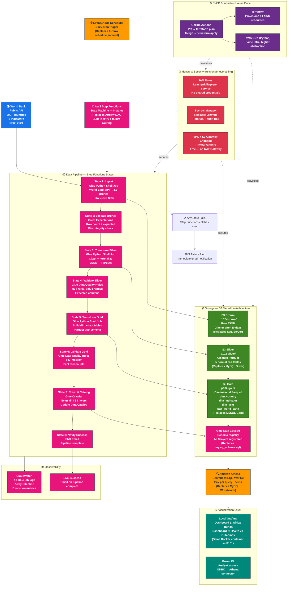
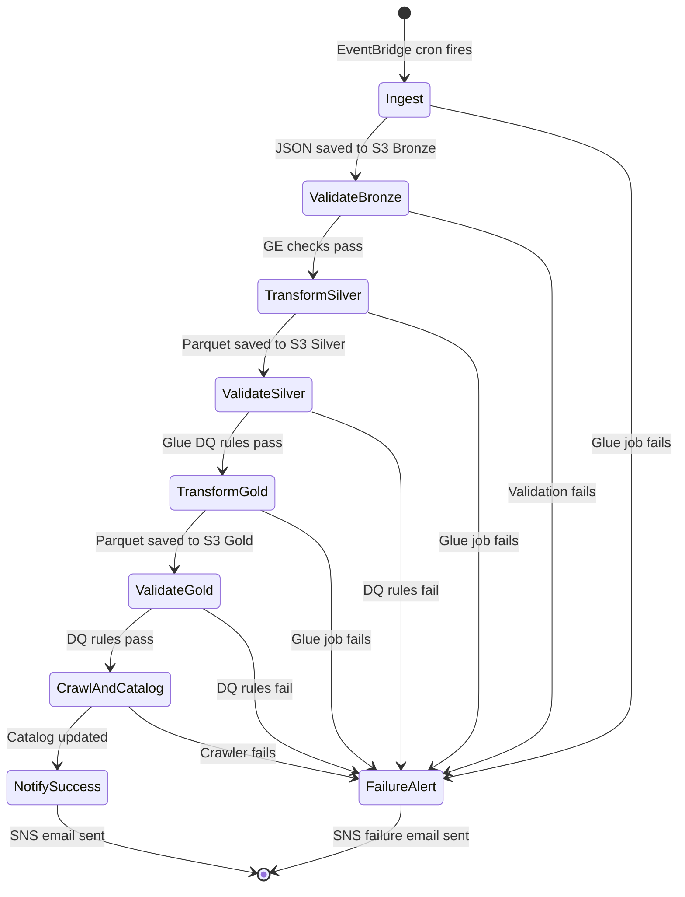
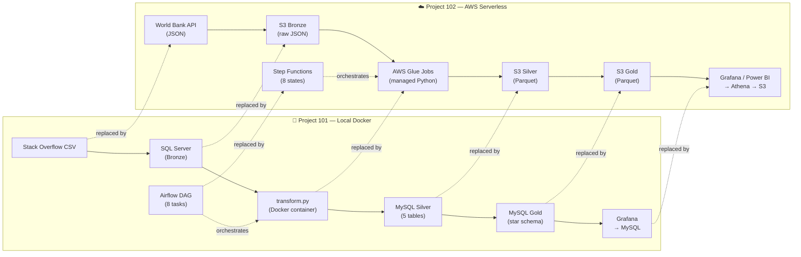

# Project 102 — Architecture Diagrams (Mermaid)

---

## Diagram 1 — Full Pipeline Architecture (Main Diagram)

---

## Diagram 2 — Medallion Architecture (Data Layers Only)

```mermaid
flowchart LR
    API["🌍 World Bank API\nJSON Response\n{country, indicator,\nyear, value}"]

    subgraph BRONZE["🥉 Bronze Layer — S3"]
        B1["raw_gdp_per_capita.json"]
        B2["raw_life_expectancy.json"]
        B3["raw_health_expenditure.json"]
        B4["raw_education_spending.json"]
        B5["raw_population.json"]
        B6["... 3 more indicators"]
    end

    subgraph SILVER["🥈 Silver Layer — S3 Parquet"]
        S1["countries.parquet\n200+ rows\ncode, name, region\nincome_group"]
        S2["indicators.parquet\n8 rows\ncode, name, category"]
        S3["observations.parquet\n~300,000 rows\ncountry, indicator\nyear, value (cleaned)"]
    end

    subgraph GOLD["🥇 Gold Layer — S3 Parquet"]
        G1["dim_country.parquet\ncountry_id, code\nname, region\nincome_group"]
        G2["dim_indicator.parquet\nindicator_id, code\nname, category"]
        G3["dim_year.parquet\nyear_id, year\ndecade"]
        G4["fact_world_bank.parquet\nfact_id\ncountry_id FK\nindicator_id FK\nyear_id FK\nvalue, loaded_at"]
    end

    ATH["Amazon Athena\nSQL queries\non Parquet files"]

    API -->|"Glue Ingest Job\nState 1"| BRONZE
    BRONZE -->|"Glue Transform Job\nState 3"| SILVER
    SILVER -->|"Glue Transform Job\nState 5"| GOLD
    GOLD --> ATH

    ATH -->|"Dashboard 1"| D1["Africa Development\nTrends\n(Cameroon focus)"]
    ATH -->|"Dashboard 2"| D2["Health Spending\nvs Outcomes"]
```

---

## Diagram 3 — Step Functions State Machine Flow

---

## Diagram 4 — Project 101 vs Project 102 Comparison

